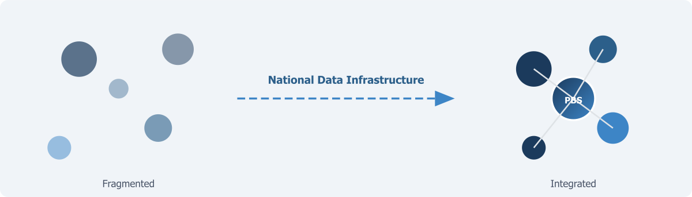

::: {.chapter-illustration}

:::

Every democratic government makes decisions on the basis of statistical information, whether it recognises this dependency or not. When National Finance Commission allocates funds across provinces, the allocation formula relies on population counts and economic indicators. When a health ministry decides where to build new facilities, it draws on data about disease burden, facility utilisation, and geographic coverage. When a planning commission sets growth targets, it uses national accounts estimates and labour force statistics. When a political opposition challenges the government's claims of progress, the challenge is credible only if there are independent numbers to point to.

> Statistics, in this sense, are not a technical luxury. They are the informational foundation on which governance, accountability, and democratic debate all rest.

When the numbers are absent, outdated, or untrustworthy, the consequences are not abstract. Resources get allocated on the basis of political bargaining rather than evidence. Policies get designed on the basis of assumptions rather than facts. Programme failures go undetected because there are no baseline measurements against which to assess performance. Citizens who suspect the government is misrepresenting conditions have no authentic source to consult. In an environment overflowing with information, the absence of credible statistics creates a space that gets filled by rumour, manipulation, and misinformation. This noise puts pressure on elected governments to combat false narratives instead of following long-term signals. The people who suffer most from this are those who are already least visible to the state.

Data infrastructure in the current AI era has become at least as important as physical infrastructure, and this is not merely a convenient analogy. A road is useful not in itself but because people and goods move on it. A statistical system is useful not because it collects data. It is useful only if the data serves governments in designing policies, businesses in planning investments, researchers in studying social and economic dynamics, journalists in holding power to account, and citizens trying to understand the conditions of their own lives. The value of data infrastructure, like the value of transport infrastructure, is realised through use. Data use and its re-use is the most important element of treating it as an asset. When data remains locked in the filing systems of government agencies, its potential is wasted as surely as a highway built to nowhere.

The United States National Academies of Sciences, Engineering and Medicine landmark 2023 report, **Toward a 21st Century National Data Infrastructure**, argued that statistical information infrastructure serves the same foundational role for governance and commerce as bridges and highways do for transport (NASEM, 2023). The report described a paradox now confronting statistical systems worldwide. The traditional method of producing national statistics — large-scale probability surveys conducted by government statistical agencies — is under severe pressure from declining participation rates, rising costs, and growing demand for more timely and granular information. Yet at the same time, the volume of digital data being generated about the activities of individuals and businesses has not been brought into the mainstream of national statistics. The challenge is to build infrastructure that can mobilise these new data assets while maintaining the rigour and public trust that legitimate statistics require.

This challenge is universal. But its stakes are particularly high in countries like Pakistan, where the gap between what the statistical system produces and what governance requires is already large and growing wider. In a country where political discourse frequently revolves around competing claims — about the size of the economy, the number of people living in poverty, the quality of public services, the distribution of resources across provinces — the absence of authoritative, timely, and trusted statistics is not merely an inconvenience. It is a structural weakness in the democratic process itself. When general literacy, digital literacy, and data literacy are extremely low, every positive news item is taken with a grain of salt while every negative claim is accepted as truth. When citizens and their elected representatives cannot agree on the facts, debate becomes a contest of assertions rather than an exchange of evidence.

> An efficient and accountable government depends fundamentally on the availability of data that all parties accept as credible.

## What Pakistan Needs to Know About Itself

Pakistan is a country of 241 million people, the fifth most populous nation on earth. It has a high population growth rate and a huge youth bulge. It is urbanising at one of the fastest rates in South Asia. The interconnected challenges are enormous: a stunting rate that affects roughly 40 per cent of children under five, a net primary enrolment rate that still leaves almost 22 million children out of school, a labour market in which the majority of employment is informal and therefore largely invisible to official statistics, an economy in which tax collection as a share of GDP remains among the lowest in the region, a poverty rate above 40 per cent, energy systems under strain, agricultural production increasingly vulnerable to climate shocks, and persistent inequalities across provinces, between urban and rural areas, and between men and women.

None of these challenges can be addressed effectively without credible data. To design a social protection programme that reaches the poorest households, one must know who is poor, where they live, and what characterises their deprivation. To improve primary education, one needs to know not just how many children are enrolled but whether they are learning and what happens to them after they leave school. To reform the tax system, one has to understand who is paying, who is not, and why. To respond to a flood or a drought, it is imperative to have real-time information about which areas are affected, how many people are displaced, and what resources they need. To assess performance of provincial governments after the 18th Amendment devolved responsibilities to the provinces, one needs provincial- and district-level data that is comparable, timely, and independently verifiable.

Pakistan needs, in other words, a statistical system capable of answering the questions that matter most for its future. The question is whether the system it currently has is up to this task.

## A System Built for a Different Era

Pakistan's statistical infrastructure was designed for the conditions of the 20th century. It has served the country with reasonable adequacy so far. The Pakistan Bureau of Statistics (PBS) — the national statistical agency operating within the Ministry of Planning, Development and Special Initiatives — has historically relied on two principal instruments: periodic censuses and sample surveys. The population census, constitutionally mandated every ten years, provides the demographic baseline. The Pakistan Social and Living Standards Measurement Survey (PSLM), the Household Integrated Economic Survey (HIES), the Labour Force Survey (LFS), and other periodic exercises provide the social and economic indicators on which policy has been built. Agriculture and economic censuses have also played a critical role.

This system has genuine strengths. Probability sampling, when properly implemented, allows a relatively small number of surveyed households to generate statistically valid estimates for large populations. The surveys conducted by PBS have produced the core indicators — literacy rates, enrolment ratios, poverty estimates, unemployment rates, health access measures — that have shaped Pakistan's development discourse for decades. The 2023 Digital Census, which deployed 121,000 enumerators equipped with tablets linked to geographic information systems, represented a significant technological advance and geo-tagged approximately 40 million structures across the country. The HIES 2024-25, released in early 2026, was the first fully digital household economic survey in PBS history.

But the model is under pressure from multiple directions simultaneously, and these pressures are intensifying.

First, the economics of survey-based data collection are increasingly unfavourable. Surveys are expensive to design, field, and process. The PSLM district-level survey requires enumerating roughly 195,000 households across thousands of sampling units — a logistically enormous operation requiring trained field staff, transport, supervision, quality control, and data processing infrastructure. As costs rise, the frequency, sample size, or geographic coverage of surveys must be sacrificed. Pakistan cannot simultaneously afford annual surveys at the district level, quarterly labour force surveys at the provincial level, and the specialised surveys on time use, disability, migration, and agriculture that specific policy questions demand. Something has to give, and what gives is either timeliness, granularity, or both. PBS conducted a time use survey in 2006-07 and it has been conducted only once — such exercises become outdated and the investment loses its value when they are not repeated.

Second, survey response rates globally are declining, and Pakistan is not immune. Respondent burden — the time and effort required to complete lengthy questionnaires — is a growing concern, particularly in urban areas where households are more mobile and less willing to participate. The HIES 2024-25 reported a non-response rate of 1.86 per cent, which appears low but understates the challenge: 157 primary sampling units out of 2,500 were dropped entirely due to administrative and other issues. In many countries, the decline in survey participation has been dramatic enough to threaten the validity of the estimates produced. The NASEM report described this as a severe threat to the quality of statistical information (NASEM, 2023). The problem is self-reinforcing: as participation declines, the remaining respondents become less representative, which erodes the quality of estimates, which erodes public trust in the numbers, which makes future participation even harder to obtain.

Third, and perhaps most important, the demand for statistical information has changed qualitatively. Policymakers no longer want national-level estimates published with a lag of a year or more after data collection. They require provincial and district-level quarterly or monthly data to track the effects of specific interventions — a cash transfer programme, a school construction initiative, a health campaign — in near real-time. They need to understand the intersections between different dimensions of wellbeing: how health affects educational outcomes, how education affects employment, and how employment affects poverty. None of these demands can be met by a system that relies exclusively on periodic, standalone surveys, each designed for a single purpose and published on its own schedule.

Fourth, and this is central to the argument of this book, the current system operates in **data silos**. PBS is the only agency with a mandate to collect data for statistical purposes. But many other organisations collect data very effectively for their own administrative purposes. NADRA maintains biometric databases covering most of the adult population. BISP manages its beneficiary registry reaching millions of households. The Federal Board of Revenue holds tax records. Provincial health and education departments maintain systems like DHIS2 and EMIS. Each agency uses its own definitions, coding systems, and formats. Most, if not all, of this data could serve statistical purposes and help meet the demand for timely, granular information. But there is no systematic mechanism for combining these sources into richer statistical products. When a researcher or policymaker needs to understand the relationship between household income, health utilisation, and educational attainment, they find that the data exists in multiple organisations but cannot be linked — because no common identifiers, shared standards, or institutional arrangements for data sharing are in place.

> Pakistan is not short of data. It is short of the infrastructure that makes data usable.

## The Census as a Case Study

The population census illustrates both the strengths and the limitations of the current system. The Constitution mandates a census every ten years, but Pakistan has managed only seven since independence — in 1951, 1961, 1972, 1981, 1998, 2017, and 2023. The gap between 1998 and 2017 — almost two decades — meant the country's most basic demographic information was severely outdated, with profound consequences for political representation, resource allocation, and development planning.

The 2023 Digital Census was a significant achievement, deploying advanced technology at enormous scale. But it also illustrated systemic challenges. Enumeration, originally planned for one month, was extended five times as coverage in major cities — Karachi, Lahore, Faisalabad — proved difficult. The results, like those of 2017 before them, became politically contested, with the Government of Sindh and several political parties challenging the count for Karachi. These controversies are not unique to Pakistan — census results are politically sensitive everywhere because they determine political representation and resource allocation. But they are made worse by the long intervals between censuses. When a country goes nineteen years without a census, the stakes attached to each individual count become so high that the exercise itself becomes a source of political conflict rather than a resolution of it.

The census also consumed enormous institutional energy and resources that, in a more diversified statistical system, might have been complemented by continuously updated population estimates derived from administrative records — birth registrations, NADRA identity records, school enrolments — rather than depending entirely on a single decennial exercise. The Nordic countries, for example, have largely replaced traditional field-based censuses with register-based censuses that use linked administrative data to produce population statistics at a fraction of the cost and with far greater frequency. Pakistan is not in a position to replicate this approach immediately, but the direction of travel is clear. The future of population statistics lies in the continuous integration of multiple data sources, not in periodic mobilisations of six-figure enumerator armies.

> This is the fundamental limitation. The current system places too much weight on large, periodic, standalone data collection exercises and too little on the continuous, systematic use of the data that government agencies already collect in the course of their daily operations. The data exists. What is missing is the infrastructure — technical, institutional, and legal — to connect it.

## The Case for Transformation

The argument developed across the chapters that follow is that Pakistan needs a fundamental shift in how it produces and uses statistical information. This does not mean abandoning surveys. Surveys and censuses are essential for measuring dimensions of life that no administrative data can capture — they have strengths which no other source has when the objective is to use data for statistical purposes. But surveys alone cannot meet future requirements. They must be supplemented with what this book calls a **National Data Infrastructure** — a coherent system that can blend survey data with administrative records, geospatial data, and other sources to produce statistics that are more timely, more granular, and more useful than any single source can provide on its own. In many cases, it may work the other way round as well: administrative data analysis validated and calibrated by surveys.

Central to this transformation is a shift in the role of PBS — from a data collector into a **national data coordinator**. This means establishing common standards for data quality, documentation, and interoperability across agencies. It means building institutional and legal frameworks for governed data sharing. It means investing in human capacity — in data science, record linkage, statistical disclosure control, and data governance. It means establishing a strong ethical foundation, including robust privacy protections and clear accountability for misuse. And it means designing data infrastructure not only for today's analytical needs but for the AI-driven methods that will increasingly define the future of official statistics.

None of this will happen in months. Nor is it possible without political support, institutional reform, and sustained investment. But inaction will cost very dearly. Designing policies for a country of 241 million people on the basis of incomplete, outdated, and fragmented information is like driving blind. The cost of building the data infrastructure that a modern statistical system demands is negligible compared to the cost of ignoring the matter.

The chapters that follow develop each element of this argument. Chapter 2 sets out what **National Data Infrastructure** actually means — its components, its requirements, and why it is much more than just technology. Chapter 3 makes the case for **blended data** — the systematic combination of survey, administrative, and other data sources — and the technical, institutional, and governance conditions it requires. Chapter 4 maps the data landscape in Pakistan, identifying who holds the data, what they hold, and what barriers stand in the way. Subsequent chapters examine governance frameworks, quality standards, ethical safeguards, the demands of artificial intelligence, and a sequenced set of priorities for moving from the current system to the one the country needs.

Throughout, the argument rests on a simple premise. **Pakistan does not lack data — it lacks a system.** The task is not primarily to collect more data. It is to build the infrastructure — technical, institutional, legal, and human — that connects what exists into a coherent, trustworthy, and usable picture of the country and its people.

## References

NASEM (2023). Toward a 21st Century National Data Infrastructure: Mobilizing Information for the Common Good. Washington, DC: National Academies Press.

NASEM (2023). Toward a 21st Century National Data Infrastructure: Enhancing Survey Programs by Using Multiple Data Sources. Washington, DC: National Academies Press.
PBS (2023). Announcement of Results of 7th Population and Housing Census-2023 'The Digital Census.' Islamabad: Pakistan Bureau of Statistics.
PBS (2025). Household Integrated Economic Survey (HIES) 2024-25. Islamabad: Pakistan Bureau of Statistics.
