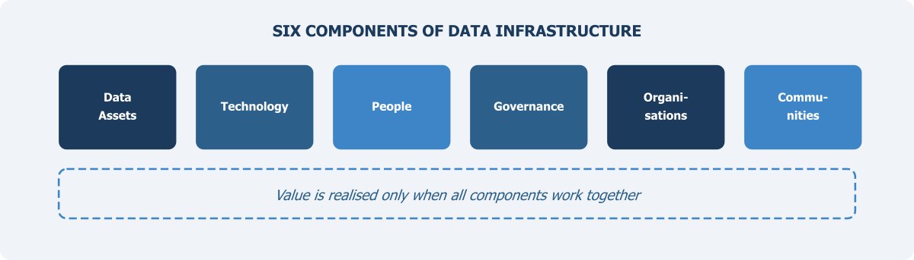

::: {.chapter-illustration}

:::

Chapter 1 established that Pakistan does not lack data — it lacks a system. Rich datasets sit with NADRA, FBR, BISP, provincial departments, and PBS itself, but they remain locked in silos, unable to speak to each other. The question that follows naturally is: what kind of system does the country actually need? That is what this chapter addresses. Before discussing what data to blend or how to govern its use, we must first understand the structure of a **National Data Infrastructure** — what its components are, how they relate to each other, and why no single component is sufficient on its own.

## What Do We Mean by Data Infrastructure?

When one hears the word "infrastructure", one thinks of roads, bridges, electricity grids, or water supply systems. Physical things. But in the 21st century, data has become an equally important foundational layer for how societies function. And just like physical infrastructure, data infrastructure is not a single thing. It is a system of many parts working together. The Open Data Institute (ODI), which has done significant work on this concept, defines data infrastructure as consisting of data assets, standards, technologies, policies, and the organisations that operate and maintain them (ODI, 2018). This is a useful starting point.

Some countries have made good progress in building comprehensive data infrastructure. But for a country like Pakistan, where the statistical system is still largely survey-dependent, the work towards it has yet to begin in earnest. At its core, a National Data Infrastructure is the whole arrangement that makes it possible to collect data, store it safely, process it, share it across organisations, analyse it, and turn it into information that people can actually use. If any part of this arrangement is missing or weak, the output suffers. One can have the best data in the world, but if there is no legal framework allowing its sharing, it stays locked in a silo. One can have excellent technology, but without skilled people to operate it, it remains underutilised.

The World Bank's Development Report 2021, titled "Data for Better Lives", made this point quite clearly. It argued that the value of data depends not just on its collection but on an entire ecosystem of governance, capacity, and trust that surrounds it (World Bank, 2021). Pakistan needs to take this seriously.

The sections that follow describe six components of a National Data Infrastructure. No single component works in isolation. Their power lies in how they connect.

## Data Assets: The Raw Material

The System of National Accounts 2025 (SNA 2025), endorsed by the UN Statistical Commission in March 2025, formally declares data as a produced asset. Data assets are the starting point of any infrastructure. These are the actual datasets, records, and files that contain information about people, businesses, transactions, geography, and so on. In Pakistan, the most visible data assets are the ones produced by PBS — household surveys, labour force surveys, the population census, agriculture census, and economic census. These are designed specifically for statistical purposes and follow established methodology. But they are not the only data that exists.

As discussed in Chapter 1, there is a large amount of administrative data sitting with federal agencies and provincial departments. NADRA holds biometric and identity records for most of the adult population. FBR has tax records. BISP maintains records of social protection beneficiaries. SECP has data on registered companies and corporate filings. Regulatory bodies in telecom, banking, and energy also generate data as part of their normal operations. Provincial governments are another major source — education departments collect enrolment and attendance data, health departments track disease surveillance and facility usage, agriculture departments collect crop data. The Economic Affairs Division (EAD) maintains data related to external economic assistance, including foreign loans, credits, grants, and technical aid from international organisations.

Then there is private sector data. Telecom companies have detailed call records and mobility data. Banks process millions of transactions daily. E-commerce platforms and digital payment systems generate data that could, in principle, provide real-time indicators of economic activity. Finally, there is data from higher education and academic institutions, NGOs, and international organisations, which often conduct their own surveys or compile datasets that supplement official statistics. Chapter 4 maps this landscape in detail.

The critical point is this: no single data source gives a complete picture. Each has gaps. Survey data is methodologically rigorous but slow and expensive. Administrative data is large and regularly updated but was not designed for statistics. Private sector data may be timely but not representative. As the UNECE guidelines on using administrative data point out, the statistical use of administrative data requires careful assessment of coverage, concepts, and quality (UNECE, 2011). The value comes from combining them thoughtfully — through what subsequent chapters will call **blended data**.

## Technology: More Than Just Computers

When we talk about technology in the context of data infrastructure, we mean the tools and systems that allow data to be discovered, accessed, stored, processed, protected, and shared. This is a broad category. It includes servers, databases, cloud computing platforms, and data warehouses. But it also includes less visible components that are equally important. Application Programming Interfaces (APIs), for example, are what allow different software systems to talk to each other and exchange data automatically. Without APIs, data sharing between agencies requires manual processes — slow, error-prone, and difficult to scale.

Data management platforms are needed for cataloguing what data exists, tracking its lineage — where it came from, how it was transformed — and maintaining metadata. Investment in metadata is need of the hour, because without it, linking datasets across agencies is not possible. Security systems — encryption, access controls, audit trails — are essential for protecting sensitive information.

One concept that is especially relevant here is **interoperability** — the ability of different systems to work together. If PBS uses one format for geographic codes and NADRA uses a different one, linking their data becomes a technical headache. Common standards, shared identifiers, and compatible formats are what make interoperability possible.

The European Interoperability Framework identifies four layers: legal, organisational, semantic, and technical (European Commission, 2017). Pakistan's National Data Infrastructure needs to address all four. It is not enough to just buy new hardware or install new software. The technology must be designed so that data can flow between organisations smoothly and securely. The real challenge is not generating data — we already generate enormous volumes — but organising, managing, and governing it in ways that make it usable.

## People and Expertise: The Human Factor

One can build the most advanced technology platform in the world. But if the people who are supposed to use it lack the necessary skills, it will not deliver results. This is a lesson that many countries have learned the hard way. A functioning data infrastructure requires people with diverse skills. Some of these are technical — data engineering, statistical programming, machine learning, database administration. But others are equally important and often overlooked: data governance specialists, legal experts who understand privacy law, statisticians who can design multi-source surveys, people who can write metadata documentation, and communication experts who can explain statistical findings to non-technical audiences.

Pakistan faces a significant skills gap in this area. PBS and provincial bureaus have experienced survey statisticians, but fewer staff with skills in data science, record linkage, or privacy-enhancing technologies. The training infrastructure for these skills is limited. Academia in Pakistan has also not played an active role and is not offering relevant programmes in sufficient numbers. The UN Statistical Commission has repeatedly emphasised that modernisation of statistical production requires not only new technologies but new competencies (UNSC, 2019). Countries that have successfully modernised — like Estonia, New Zealand, and the Netherlands — invested heavily in retraining their statistical workforce alongside technology upgrades.

Building human capacity takes time. It cannot be done overnight. But it can be started immediately through targeted training programmes, partnerships with universities, staff exchanges with other national statistical offices, and recruitment of specialists from the private sector. Without this investment, technology alone will not solve the problem.

## Governance, Standards, and Legal Framework

This is perhaps the least visible but most critical component of a National Data Infrastructure. Governance refers to the rules, policies, processes, and institutional arrangements that determine how data is managed throughout its lifecycle. The DAMA International Data Management Body of Knowledge defines data governance as the exercise of authority, control, and shared decision-making over the management of data assets (DAMA International, 2017). In practical terms, this means answering questions like: Who is responsible for a given dataset? Who can access it? For what purposes? Under what conditions? How is quality ensured? How are disputes resolved?

For Pakistan, governance challenges are significant. There is no comprehensive legal framework that specifically addresses data sharing for statistical purposes across agencies. The Statistics Act provides PBS with certain authorities, but it does not fully cover the landscape of multi-source data that a modern infrastructure requires.

Standards are a closely related issue. Data standards define how data should be structured, labelled, classified, and documented so that it can be understood and used across organisations. Without common standards, one agency records income in monthly terms, another in annual terms, and a third uses different categories altogether. Linking such data becomes extremely difficult. International standards like the Statistical Data and Metadata Exchange (SDMX) framework provide a starting point (SDMX.org, 2023). But these need to be adapted and adopted at country level. Pakistan has made limited progress in this area so far.

The legal framework also needs attention. Laws governing privacy, data protection, and access to government records need to be reviewed and updated. Many countries have enacted specific legislation to enable the use of administrative data for statistics — for example, Australia's Data Availability and Transparency Act 2022. Pakistan needs similar legislative effort to provide legal clarity and protections for all parties. The governance of data is not just a technical matter — it is a deeply social and political one.

## Organisations and Institutional Arrangements

Data infrastructure does not operate in a vacuum. It is managed, maintained, and governed by organisations. These include statistical agencies (PBS and provincial bureaus), data-holding agencies (NADRA, FBR, BISP, EAD, SBP, among others), oversight bodies, and coordination mechanisms.

At present, there is no formal institutional mechanism for coordinating data access and sharing between PBS and other federal or provincial agencies. Each agency has its own mandate, its own systems, and its own concerns about sharing data. This fragmentation is not unique to Pakistan. Many countries faced similar challenges before undertaking reforms. The United Kingdom established the UK Statistics Authority as an independent body to oversee the statistical system and promote data sharing across government (UK Statistics Authority, 2007). Canada has the Canadian Centre for Data Development and Economic Research (CDER) to facilitate access to data from multiple sources.

Whatever organisational model Pakistan chooses, certain features are essential. There must be a clear mandate and legal authority, accountability to the public, and mechanisms for coordination that bring different data holders together rather than leaving each agency to operate on its own. And the institutional design must recognise that data infrastructure is not only about government — private sector, academia, and civil society all have roles to play. A modern National Data Infrastructure is a multi-stakeholder system. Its governance must reflect this reality.

This book's argument is that PBS is the natural institution to serve as **national data coordinator** — not because it should control all data, but because it has the statistical mandate, the methodological expertise, and the institutional standing to coordinate across agencies while maintaining the independence and quality standards that official statistics demand.

## Communities and Data Subjects

This component is often left out of technical discussions about data infrastructure, but it is among the most important. Much of the data we are talking about comes from people — citizens, households, businesses, communities. These are the data subjects. Their trust is essential. If people do not believe that their data will be handled responsibly, they will resist providing it. Survey response rates will continue to decline. Public opposition to data linking will grow. And the whole system will lose credibility.

The OECD's Recommendation on Good Statistical Practice states that public trust is a cornerstone of official statistics and that statistical systems must operate with transparency, accountability, and respect for individual privacy (OECD, 2015). This is not abstract. It has direct implications for how data infrastructure is designed and communicated to the public.

In Pakistan, building this trust requires active effort. Data literacy programmes have to be launched. People need to understand what data is being collected about them, how it is being used, and what safeguards are in place. There should be clear, accessible communication — not just legal notices buried in government websites, but genuine public engagement. Communities that are particularly vulnerable — low-income groups, minorities, women — may have additional concerns about how their data is used. The infrastructure must be designed with these concerns in mind. Data systems can reinforce existing inequalities if they are not designed with equity and inclusion as explicit goals.

## Tying It All Together

A National Data Infrastructure is not any single component described above. It is the way all of these components work together. Data assets require technology to be processed. Technology demands skilled people to operate it. People need governance frameworks to guide their work. Governance depends on legal authority for enforcement. And all of it needs the trust and participation of the communities whose data makes the system possible.

Think of it like a road system. The road itself (data assets) is necessary, but so are traffic rules (governance), traffic police (organisations), drivers who know how to drive (people), road signs and markings (standards), and the communities that use the road and benefit from the commerce it enables. Remove any of these elements and the system breaks down.

Pakistan's challenge is to build this system in a coherent way — not piece by piece in isolated projects, but as an integrated National Data Infrastructure that serves the country's information needs for decades to come.

::: {.callout-tip}
## Think of It This Way
Data infrastructure is to statistical information what road infrastructure is to commerce. It is the underlying system of assets, tools, rules, people, and institutions that makes the production and use of statistics possible. And like physical infrastructure, it gains value only through use.
:::

Now that we have established what a National Data Infrastructure looks like in principle — its components, their relationships, and the conditions they require — the next question is practical: how do these components actually come together to produce better statistics? That is the subject of Chapter 3, which makes the case for **blended data** — the systematic combination of survey, administrative, and other data sources — and examines what it takes to make blending work.

---

## References

- Couldry, N. and Mejias, U. (2019). *The Costs of Connection: How Data is Colonizing Human Life and Appropriating It for Capitalism.* Stanford University Press.
- DAMA International (2017). *DAMA-DMBOK: Data Management Body of Knowledge.* 2nd Edition. Technics Publications.
- European Commission (2017). *New European Interoperability Framework.* Publications Office of the European Union.
- Floridi, L. and Taddeo, M. (2016). "What is Data Ethics?" *Philosophical Transactions of the Royal Society A,* 374(2083).
- Kitchin, R. (2014). *The Data Revolution: Big Data, Open Data, Data Infrastructures and Their Consequences.* SAGE Publications.
- ODI — Open Data Institute (2018). *What is Data Infrastructure?* Available at: https://theodi.org/
- OECD (2015). *Recommendation of the Council on Good Statistical Practice.* OECD Legal Instruments.
- SDMX.org (2023). *Statistical Data and Metadata Exchange: Technical Standards.* Available at: https://sdmx.org/
- UK Statistics Authority (2007). *Code of Practice for Statistics.* London: UK Statistics Authority.
- UNECE (2011). *Using Administrative and Secondary Sources for Official Statistics: A Handbook of Principles and Practices.* United Nations, Geneva.
- UNSC — United Nations Statistical Commission (2019). *Global Assessment of the Modernisation of Statistical Production and Services.* Background document, 50th Session.
- World Bank (2021). *World Development Report 2021: Data for Better Lives.* Washington, DC: World Bank.
