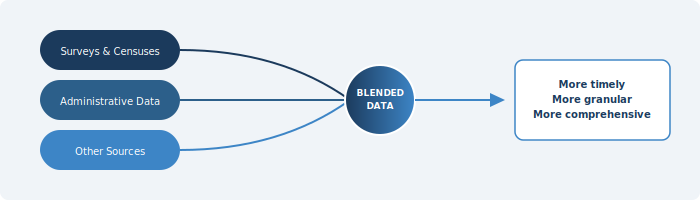

::: {.chapter-illustration}

:::

Chapter 2 described the six components of a National Data Infrastructure — data assets, technology, people, governance, organisations, and communities. But a framework on paper means little if it does not translate into a practical method for producing better statistics. The most significant practical shift that a National Data Infrastructure enables is the move toward **blended data**: combining information from multiple sources — surveys, censuses, administrative records, private sector data, and digital data — to produce statistical outputs that are more timely, more detailed, and more accurate than any single source could provide on its own.

The idea is not new in principle. Statistical agencies have always supplemented one data source with another when convenient. What is new is the scale at which this is now both possible and necessary. This is not merely a technical aspiration — it is a response to the information demands of modern society that no single-source model can meet.

The NASEM report made this case explicitly, arguing that careful blending of data from multiple, complementary sources offers a way to generate more detailed, timely, and useful statistical information than is currently available (NASEM, 2023, p. 27). It is a recognition that the traditional model — in which statistical agencies design, collect, and process their own data in relative isolation — is no longer sufficient.

For Pakistan, where the statistical system faces severe constraints of budget, coverage, and timeliness as described in Chapter 1, the case for blended data is pressing. But it is also difficult to execute. The infrastructure, legal frameworks, and institutional arrangements needed to blend data from diverse sources are not yet in place.

## Why No Single Source Is Enough

Each data source has its own weaknesses, and these weaknesses are well documented. Understanding them is the starting point for understanding why blending is necessary.

**Surveys** have historically been the backbone of national statistics. PSLM, HIES, LFS and others provide structured, well-documented data collected using probability sampling methods. But as Chapter 1 detailed, surveys are under pressure everywhere — rising costs, declining response rates, and growing demands for timeliness and granularity that periodic surveys cannot meet. The U.S. Current Population Survey saw its response rate drop from over 95 per cent in the 1990s to below 85 per cent by the late 2010s. The American Community Survey fell from around 97 per cent to approximately 86 per cent over a similar period (NASEM, 2023, Table 2-1). Pakistan's household surveys face their own challenges — security constraints in certain regions, limited field staff, poor infrastructure in remote areas, and respondent fatigue all contribute to growing nonresponse. Survey research globally has entered what Groves (2011) called a "third era" characterised by falling participation, rising costs, and increasing reliance on supplementary sources.

Beyond response rates, surveys are expensive and slow. A typical household survey in Pakistan takes 12 to 18 months from fieldwork to publication, which limits its usefulness for policy decisions that require timely data. Sample sizes also impose limits on granularity — most surveys cannot produce reliable district-level statistics for important indicators like poverty or unemployment.

**Administrative records** offer the advantage of large coverage and low marginal cost, since the data already exists as a byproduct of government operations. Tax records, social protection registries, civil registration, health facility records — these cover large populations and are updated regularly. But they were not designed for statistical purposes. As Wallgren and Wallgren (2007) noted, administrative data reflects "administrative reality, not statistical reality." The definitions used in a tax system or a social programme may not match the concepts that statistical agencies need to measure. Coverage may be incomplete — Pakistan's tax base covers only a fraction of the working population. Data quality depends on the administrative process that generates it, which may vary across regions, change over time, or be affected by fraud and underreporting.

The U.S. experience illustrates both the promise and the limitations. The Census Bureau has used federal tax data in its economic censuses since the 1950s and in building its business register since the early 1970s (NASEM, 2023, p. 77). Yet even in that mature system, legal restrictions prevent the sharing of certain tax data between statistical agencies. If the United States, with its well-resourced institutional infrastructure, struggles with these barriers, the challenges for Pakistan are likely to be even more significant.

**Private sector data** — from telecom companies, banks, digital platforms, retailers — can be extraordinarily timely and granular. Transaction data can provide near-real-time indicators of economic activity. Mobile phone metadata has been shown to predict poverty levels at fine spatial resolution (Blumenstock, Cadamuro, & On, 2015). Scanner data from supermarkets has been used in the Netherlands to compile consumer price indices with greater accuracy and lower respondent burden than traditional price collection (Chessa, 2016). But private sector data has its own problems. Companies have legitimate concerns about commercial confidentiality. Data quality is not always clear — it is available in large volumes but needs considerable work to become useful for statistics. Coverage depends on who uses the service, which typically skews toward wealthier, younger, and more urban populations. Data definitions can change without notice when companies update their systems. In a country with huge digital inequalities, this data may suffer from serious representation bias.

**Satellite imagery, social media, and crowdsourced data** are also emerging sources, but with inherent complications. These sources can be large in volume but noisy and difficult to interpret. They often lack the metadata needed to assess quality or fitness for statistical use.

No single source resolves all these weaknesses. But when carefully combined, different sources can compensate for each other's limitations. Survey data provides the statistical framework, quality controls, and conceptual definitions. Administrative data fills coverage gaps and reduces respondent burden. Private sector data adds timeliness and granularity. The result is a richer, more complete picture — one that none of these sources could produce alone.

## What Blended Data Requires

Recognising the value of blended data is one thing. Actually producing it is quite another. The technical, institutional, human resource, and governance requirements are substantial, and they cut across multiple dimensions.

### New Statistical Methods

Combining data from different sources is not straightforward, and it cannot be done by simply appending one dataset to another. Each source has its own coverage, its own definitions, its own error structure, and its own biases. Bringing them together requires statistical methods that were not part of the traditional survey statistician's toolkit.

Lohr and Raghunathan (2017), in their review in *Statistical Science*, identified four broad families of methods for combining data from multiple sources. The first is **record linkage** — matching individual records across datasets using identifying information like names, identity numbers, or addresses. This is the most direct form of data integration and has been used extensively in countries with well-developed statistical infrastructure. Linkage rates vary across studies and subpopulations, and linkage requires individual-level data with sufficient identifying information from each source. In Pakistan, where the CNIC number could serve as a universal linkage key, the potential for record linkage is considerable — but realising it depends on legal access to the relevant datasets.

The second family is **multiple frame methods**, in which independent samples from different sampling frames are combined to improve coverage or reduce costs. This technique has a long history in survey statistics (Lohr, 2021) and can be adapted to the multi-source environment by treating administrative registers or private datasets as additional frames.

Third, **imputation-based methods** treat the problem of combining sources as a missing data problem. Variables available in one dataset but not another can be imputed using statistical models that exploit relationships among observed variables. While imputation provides a transparent framework, it requires considerable expertise and careful attention to the differences between sources — in respondent types, interview modes, survey contexts, and measurement approaches.

Fourth, **modelling techniques** can be used when direct linkage or imputation is not possible. These include small area estimation, Bayesian hierarchical models, and machine learning methods. In simple terms, these approaches help produce reliable estimates even when data is incomplete or not perfectly connected. Researchers have used satellite images together with survey data to estimate poverty at very detailed local levels (Jean et al., 2016).

Proper coordination across organisations is essential when combining different data sources. Equally, the people working in these systems must have the right skills and expertise. In Pakistan, where technical capacity in PBS and provincial bureaus is still developing, investing in these skills is not just a good idea — it is essential. Without this, meaningful use of blended data will remain very difficult.

### New Statistical Designs

This is perhaps the most exciting dimension of blended data, though it is not discussed enough. When different data sources are available, the design of statistical programmes itself can change. The traditional approach — in which a single survey is designed to capture all needed information — gives way to an approach in which different sources are assigned different roles, and survey designs are optimised to complement what other sources already provide.

Instead of conducting large surveys everywhere, surveys can become more focused. Areas where administrative data is already strong may need less survey effort, while areas with weak or missing data can be studied more carefully. In practical terms, this means surveys become smaller but more targeted — filling gaps that administrative and private sector data cannot cover.

A good example comes from the United States, where residential construction statistics have been modernised (NASEM, 2023, p. 31). Earlier, data was collected from thousands of local authorities issuing permits. Now, much of this information comes from third-party sources, with only a small sample used to complete the picture. Satellite images are also used to track construction activity instead of relying on phone interviews. The statistics are more detailed and available at a finer level, while also reducing the overall cost.

For Pakistan, the implication is significant. The country cannot afford large-scale surveys at the frequency and granularity that modern policymaking demands. But if administrative data from agencies like NADRA, FBR, SECP, NEPRA, PEMRA, EAD, and BISP can be systematically accessed and combined with periodic surveys, the surveys themselves can be redesigned — smaller, cheaper, and more focused — while the blended output is more comprehensive than either source alone.

This requires developing capabilities that many statistical agencies currently lack. **Data design, definition, and description** for data not originally built for statistical analysis is perhaps the most critical gap. Administrative and private sector data typically lack the metadata documentation that survey datasets carry. Variables may not be clearly defined.

**Data logistics** — managing the supply chain of data from holders to users and back — is another new capability. So far PBS has been designing and collecting statistical data. The data sat behind the agency's firewall, under its full control. In a blended data world, agencies must negotiate access to datasets held by other organisations, often on an ongoing basis, under conditions that respect the data holder's interests. This is fundamentally different from traditional data collection.

**Data integration** — the ability to link, combine, and align datasets from multiple sources — requires not just technical tools but deep substantive understanding of what each dataset represents and where its limitations lie.

> The data silos described in Chapter 1 no longer serve the needs of modern society. PBS needs significant investment to build up the integration capabilities that a blended data system demands.

### New Quality Frameworks

Blending data from multiple sources does not just add complexity — it fundamentally changes how quality must be assessed. Conventional quality frameworks were designed for single-source data, typically surveys, where concepts like sampling error, nonresponse bias, and measurement error had well-understood definitions and estimation methods. When multiple sources are combined, the quality of the blended output depends on the quality of each input, the method used to combine them, and the **fitness of the result for its intended purpose**.

The U.S. Federal Committee on Statistical Methodology (FCSM) addressed this in its 2020 report, *A Framework for Data Quality*, which defined quality as the degree to which data captures the desired information using appropriate methodology in a manner that sustains public trust (FCSM, 2020, p. 6). The framework identifies 11 dimensions grouped across three domains: utility (relevance, accessibility, timeliness, punctuality, granularity), objectivity (accuracy, coherence, comparability), and integrity (credibility, transparency, confidentiality). Importantly, it applies to all data types — surveys, administrative records, blended data, and emerging sources — and emphasises **fitness for use** rather than adherence to any single standard of accuracy.

This concept of fitness for use is directly relevant for Pakistan. Any move toward blended data will require quality assessment protocols that go beyond traditional survey error frameworks. The quality of an administrative dataset from SECP or FBR cannot be evaluated using the same metrics as a probability survey. Different questions must be asked — about coverage completeness, definitional consistency, update frequency, and processing integrity. And when such data is combined with survey data, the quality of the blend must be assessed as a whole, not just source by source.

### New Privacy Safeguards

Blending data from multiple sources increases the potential for re-identification of individuals. A dataset that is anonymised on its own may become identifiable when linked with another dataset. This is a well-known risk in the privacy literature, and it becomes more acute as the number and diversity of data sources increase.

The NASEM panel devoted considerable attention to this challenge, noting that a 21st century National Data Infrastructure cannot succeed without ensuring ethical exchange of data, trust in institutions, privacy-preserving techniques, and technical, organisational, and legal mechanisms supporting responsible data practices (NASEM, 2023, p. 99). The panel identified four ethical values that must underlie data infrastructure: attention to how use of a subject's data affects their life, respect for autonomy and informed consent, concern for beneficence, and respect for human dignity.

On the technical side, advances in privacy-enhancing technologies offer new possibilities — differential privacy, synthetic data generation, secure multiparty computation, and homomorphic encryption are all being explored in various countries.

For Pakistan, where public trust in government handling of personal data is limited and legal frameworks for data protection are still developing, these safeguards are not secondary concerns — they are preconditions. Without credible privacy protections, neither citizens nor private sector data holders will support the data sharing that blended statistics require. The **Five Safes framework** (Desai, Ritchie, & Welpton, 2016) — safe projects, safe people, safe settings, safe data, and safe outputs — offers a practical model for structuring access controls, one that several countries including the UK and Australia have adopted successfully.

### International Experience and Lessons

The move toward blended data is not happening in a vacuum. Many countries are already well advanced, and their experiences offer useful lessons.

Statistics Canada has adopted an "administrative data first" policy, meaning it seeks to use existing administrative records before resorting to new data collection. Canada also developed the necessity and proportionality criteria for data intake — acquiring no more data than needed for the specified statistical purpose and considering the sensitivity and confidentiality of the data (Bowlby, 2021). This disciplined approach avoids unbridled harvesting of all available data and focuses resources where they are most needed.

Statistics Netherlands has been a pioneer in using private sector data for official statistics. Its work on scanner data for consumer price indices demonstrated that electronic transaction data from supermarkets could replace much of traditional manual price collection. The Dutch approach shows that private sector data can not only supplement but in some cases improve upon traditional methods — but only after considerable investment in methodology and data quality assessment.

The United Kingdom created the UK Statistics Authority as an independent oversight body responsible for promoting and safeguarding official statistics that serve the public good (NASEM, 2023, p. 59). This kind of institutional accountability is important for building public trust when statistical systems move toward using more diverse and sensitive data sources.

For Pakistan, the lesson from international experience is not that it should replicate any single country's approach. Legal frameworks, institutional capacities, and data landscapes differ too much for that. The lesson is rather that blended data is not an abstract aspiration — it is a practical reality in many countries, achieved through a combination of legal reform, institutional investment, methodological development, and sustained partnership between statistical agencies and data holders. Pakistan can learn from these experiences, but it has to develop local capacity. This is not a one-off exercise but an ongoing scientific process, and adapting to own context is important.

## What Blended Data Does Not Mean

A few points need to be made clear to avoid confusion.

Blended data does not mean that surveys will disappear. Surveys remain essential, especially for measuring things that cannot be captured through administrative records or transactions. PBS surveys are already serving a very useful purpose, measuring social, demographic, economic, and many other indicators. What really changes is their role. Instead of being the only source, surveys become one part of a larger system with multiple data sources. The idea is to redesign surveys, not to stop them.

Blended data does not mean collecting all available digital data without thinking. There must be a clear purpose behind every data acquisition. If we just try to use every available dataset, it is like jumping into the ocean without knowing where to go — no matter how good someone is at swimming, they can still get lost. Data should be collected based on need. It must serve a specific statistical purpose. And we should only acquire as much data as is required for that purpose — not more.

Finally, blending data does not reduce the need for checking quality. In fact, it makes quality assurance even more important. Each data source must be carefully evaluated on its own, and the final combined output should also be checked to see if it is fit for its intended use. Without strong quality checks, there is a risk that the statistics may look complete and impressive but are actually based on weak or unverified data.

::: {.callout-warning}
## A Critical Shift
The features of 20th century data systems must change. This demands enhanced capabilities across the board — in methods, technology, governance, and privacy protection. For Pakistan, where the statistical system still operates largely in the traditional single-source model, this shift represents both the biggest challenge and the biggest opportunity.
:::

But none of this is possible without first understanding who holds the data that Pakistan needs to blend. The landscape of data holders — statistical agencies, federal departments, provincial governments, private sector, academia — is the subject of Chapter 4, which maps what exists, who controls it, and what barriers must be overcome before blending can begin.

## References

Blumenstock, J., Cadamuro, G., & On, R. (2015). Predicting poverty and wealth from mobile phone metadata. *Science*, 350(6264), 1073–1076.

Bowlby, G. (2021). Private sector administrative data and the Canadian statistical system. Presentation to the National Academies' Panel on the Scope, Components, and Key Characteristics of a 21st Century Data Infrastructure, December 9, 2021.

Chessa, A. G. (2016). A new methodology for processing scanner data in the Dutch CPI. *Eurostat Review on National Accounts and Macroeconomic Indicators*, 1/2016, 49–69.

Desai, T., Ritchie, F., & Welpton, R. (2016). Five Safes: Designing data access for research. Working Paper, University of the West of England.

Federal Committee on Statistical Methodology. (2020). *A Framework for Data Quality*. FCSM-20-04. September 2020.

Groves, R. M. (2011). Three eras of survey research. *Public Opinion Quarterly*, 75(5), 861–871.

Jean, N., Burke, M., Xie, M., Davis, W. M., Lobell, D. B., & Ermon, S. (2016). Combining satellite imagery and machine learning to predict poverty. *Science*, 353(6301), 790–794.

Lohr, S. L. (2021). Multiple-frame surveys for a multiple-data-source world. *Survey Methodology*, 47(2), 229–263.

Lohr, S. L., & Raghunathan, T. E. (2017). Combining survey data with other data sources. *Statistical Science*, 32(2), 293–312.

National Academies of Sciences, Engineering, and Medicine. (2017). *Federal Statistics, Multiple Data Sources, and Privacy Protection: Next Steps*. Washington, DC: The National Academies Press.

National Academies of Sciences, Engineering, and Medicine. (2023). *Toward a 21st Century National Data Infrastructure: Mobilizing Information for the Common Good*. Washington, DC: The National Academies Press. https://doi.org/10.17226/26688.

Wallgren, A., & Wallgren, B. (2007). *Register-Based Statistics: Administrative Data for Statistical Purposes*. Chichester: John Wiley & Sons.
