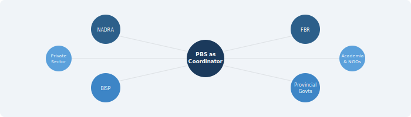

::: {.chapter-illustration}

:::

Chapter 3 established that blended data — combining surveys, administrative records, private sector data, and other sources — is the practical method through which a National Data Infrastructure produces better statistics. But blending requires raw material. Before any data can be linked, harmonised, or combined, we must first understand who holds the data that can contribute to better national statistics.

This might seem like a straightforward question. In practice, Pakistan's data landscape is fragmented across dozens of organisations, each with its own mandate, its own systems, and its own reasons for collecting data. Statistical agencies produce data specifically for statistical purposes. Other organisations produce data for entirely different reasons. Yet all of them hold information that, if brought together thoughtfully, could transform the country's ability to understand itself.

As the UNECE noted in its guidelines on using secondary data sources, the potential supply of data for official statistics extends far beyond what statistical offices themselves collect (UNECE, 2011). The challenge is mapping this landscape, understanding what each holder brings to the table, and creating the conditions under which their data can be accessed and used for statistical purposes.

## Statistical Agencies

The Pakistan Bureau of Statistics (PBS) and the provincial Bureaus of Statistics are the primary producers of official statistics in the country. They conduct the population census, labour force surveys, household income and expenditure surveys, agricultural surveys, and a range of other data collection exercises. Their mandate is explicitly statistical — they collect data to produce estimates that inform public policy and planning.

This matters because it means their data follows established quality controls. Sampling frames are designed, questionnaires are tested, fieldwork is supervised, and results go through validation and estimation procedures. The UN Fundamental Principles of Official Statistics lay out the standards that national statistical offices are expected to follow — professional independence, scientific methods, and confidentiality of individual data (United Nations, 2014). PBS operates under these principles.

But PBS and provincial bureaus face well-known constraints. Their budgets are limited. The population census, the most comprehensive data collection exercise, happens only once a decade — and has faced significant delays in Pakistan's history, as Chapter 1 documented. Between censuses, surveys provide useful but incomplete pictures. Labour force surveys have sample sizes that do not allow reliable estimates at the district level for many indicators. Household surveys typically take a couple of years from fieldwork to publication, which limits their timeliness. The pressures of declining response rates, rising costs, and growing demand for supplementary sources — what Groves (2011) termed the "third era" of survey research — apply to Pakistan as they do everywhere, compounded by security challenges in certain regions and weak infrastructure in remote areas.

Provincial Bureaus of Statistics deserve separate mention. Since the 18th Constitutional Amendment devolved significant responsibilities to provinces, provincial statistical capacity has become more important. But most provincial bureaus remain understaffed and under-resourced. Their relationship with PBS is also complicated — there is no uniform framework for how federal and provincial statistical agencies coordinate data collection, share data, or harmonise standards.

Despite all these limitations, statistical agencies remain the backbone of the system. They have the mandate, the institutional knowledge, and the methodological expertise. What they lack — and what the **national data coordinator** role described in Chapters 1 and 2 would address — is systematic access to the wider data ecosystem that could supplement their surveys and make their estimates more timely, more granular, and more comprehensive.

## Federal Administrative Agencies

Some of the richest data in Pakistan sits with federal agencies that collect it not for statistical purposes but as part of their normal administrative functions. This data is generated as a byproduct of government operations — registering citizens, collecting taxes, delivering social protection, regulating businesses.

**NADRA** (National Database and Registration Authority) is perhaps the most significant data holder in this category. It maintains the national identity database covering a very large proportion of Pakistan's adult population through the Computerised National Identity Card (CNIC) system. NADRA's data includes biometric information, addresses, family linkages, and demographic details. The database has already been used beyond its original registration mandate — for BISP social protection verification, electoral rolls, and SIM card registration. The potential of universal identity systems for statistical purposes has been explored in other countries; India's Aadhaar system, for instance, has been discussed as a backbone for linking administrative records across agencies (Abraham et al., 2018). Pakistan's CNIC system has similar potential, though it also raises significant privacy concerns that must be addressed through the safeguards discussed in Chapter 3.

**FBR** (Federal Board of Revenue) holds tax records for individuals and businesses — income tax returns, sales tax data, customs records, and withholding tax information. Tax data can provide detailed information about economic activity, income distribution, and the size of the formal economy. However, Pakistan's tax base is notoriously narrow — the number of registered taxpayers does not come close to covering the full working population — which limits coverage. Tax data also has well-known issues with underreporting and evasion, which statistical agencies would need to account for.

**BISP** (Benazir Income Support Programme) maintains detailed records on social protection beneficiaries. Its National Socioeconomic Registry (NSER), compiled through a door-to-door poverty census, covers a very large number of households and contains information about demographics, assets, housing conditions, and vulnerability indicators. The NSER is one of the most comprehensive household-level databases in Pakistan and could be extremely valuable for producing poverty statistics and calibrating survey estimates.

**SECP** (Securities and Exchange Commission of Pakistan) holds data on registered companies, corporate filings, financial statements, and securities markets — useful for understanding the corporate sector, investment patterns, and economic concentration.

Other federal agencies holding significant data include the State Bank of Pakistan (financial system data), Pakistan Telecommunication Authority (telecom subscriber data), NEPRA (electricity consumption data), OGRA (oil and gas data), and various line ministries that maintain management information systems for their programmes.

The common challenge across all these agencies is the point Wallgren and Wallgren (2007) made clearly: administrative data reflects administrative reality, not statistical reality. The definitions, classifications, coverage, and quality controls were designed to serve operational purposes — not statistical analysis. Converting administrative data into statistical outputs requires careful assessment and adjustment, as discussed in Chapter 3's treatment of fitness for use. Coverage may not be universal. Definitions may not match survey concepts. Data quality may vary across regions or over time.

Despite these challenges, the volume and richness of administrative data in Pakistan is considerable. The key barrier is not the data itself but the lack of frameworks, legal provisions, and institutional mechanisms for accessing it for statistical purposes.

## Provincial Governments

Pakistan's provinces hold enormous amounts of data across their departments and agencies. Since the 18th Amendment, provinces have primary responsibility for health, education, agriculture, local governance, and many social services. GST data collection also falls within the domain of provincial revenue authorities. This means that much of the data about how services are delivered — and what outcomes they produce — sits at the provincial level.

Education departments in all four provinces and the federal areas maintain Education Management Information Systems (EMIS) that track school enrolment, attendance, teacher deployment, and infrastructure. Punjab and Sindh have invested more heavily in digitising these systems, while Balochistan and Khyber Pakhtunkhwa face greater challenges. This data can provide granular, real-time information about educational access that household surveys can only capture periodically.

Health departments collect data through the District Health Information System (DHIS2), tracking facility-based health indicators including disease surveillance, immunisation coverage, maternal health services, and facility utilisation. Pakistan adopted the DHIS2 platform used in many developing countries, and this data is potentially very useful for producing health statistics between surveys. However, private health facilities — which account for a large share of healthcare delivery in Pakistan — are generally not covered.

Agriculture departments maintain crop reporting systems, livestock census data, and agricultural inputs data. Given that agriculture remains a large part of Pakistan's economy and employs a significant share of the workforce, this data is directly relevant for national accounts and food security analysis. Provincial agricultural census data is also available.

Revenue departments hold land records, property transaction data, and related information relevant for wealth estimation and economic analysis. Many provinces have been digitising their land records through projects like Punjab's Land Records Management Information System.

Social welfare departments, labour departments, local government bodies, and planning departments all generate data as part of their work. The problem is that this data is often not standardised, not easily accessible, and not shared with statistical agencies at either the provincial or federal level.

The fragmentation between provinces is a significant issue in itself. Each province may use different classifications, different software systems, and different data formats. There is no common framework for harmonising provincial data, which makes it very difficult to produce consistent national-level statistics from provincial sources. This kind of harmonisation challenge is not unique to Pakistan — Groen (2012) documented similar issues in the United States, where state-level administrative records needed significant work before they could serve federal statistical purposes. But it is a problem that Pakistan must solve if provincial data is to be effectively used.

## Private Sector

The private sector in Pakistan generates a massive volume of data that could, under appropriate conditions, significantly improve the timeliness and granularity of national statistics. International practice in this area is evolving rapidly, as Chapter 3 noted when discussing the Dutch and Canadian experiences.

Telecommunications companies — Jazz, Telenor, Zong, Ufone — collectively serve the overwhelming majority of Pakistan's mobile subscribers. Their data includes call detail records, mobile money transactions (especially through platforms like JazzCash and Easypaisa), and location data derived from cell tower connections. This data can provide near-real-time indicators of population mobility, economic activity, and even disaster displacement.

Banks and financial institutions process millions of transactions daily. Transaction data can provide timely indicators of consumer spending, economic confidence, and financial inclusion. The State Bank of Pakistan already publishes aggregate financial statistics, but more granular data from individual banks — properly anonymised — could enhance economic measurement.

E-commerce and digital platforms — Daraz, InDrive, Bykea, Careem, Foodpanda, and various digital payment systems — generate data on consumer behaviour, service demand, pricing, and employment in the gig economy. These platforms are growing rapidly in Pakistan and their data could help capture economic activities that traditional surveys miss.

Large retailers, manufacturers, and agricultural commodity markets also hold data that could provide high-frequency economic indicators.

But private sector data comes with significant complications that must not be understated. Companies have legitimate concerns about commercial confidentiality — sharing data with government may expose proprietary business information. There are questions about data quality, representativeness (not everyone uses digital services equally), and stability — companies can change their systems, definitions, or simply cease operations. Privacy is another major concern; individual-level data from telecom or financial companies is highly sensitive. Any use of such data for statistical purposes must be governed by the strict legal frameworks and the kind of access controls described in Chapter 3 — the **Five Safes framework** provides one practical model for managing these risks.

The key point is that private sector data is not a replacement for surveys or administrative records. It is a complement. Its value lies in timeliness and granularity, but these advantages must be weighed against issues of access, quality, representativeness, and privacy.

## Academic and Nonprofit Institutions

Universities, research organisations, think tanks, and international NGOs produce a substantial amount of data in Pakistan that can supplement official statistics. This data is often overlooked in discussions about national statistical systems, but it should not be.

Organisations like the Pakistan Institute of Development Economics (PIDE), Lahore University of Management Sciences (LUMS), the Institute of Development and Economic Alternatives (IDEAS), and the Sustainable Development Policy Institute (SDPI) conduct surveys, compile datasets, and produce research covering topics from poverty dynamics to urban development to labour market informality. International organisations like the World Bank, UNICEF, WHO, and FAO also fund and conduct data collection in Pakistan — the Multiple Indicator Cluster Survey (MICS), Demographic and Health Survey (DHS), and various agricultural assessments being prominent examples.

These datasets sometimes fill gaps that official statistics do not cover. They may use innovative methodologies, address emerging issues before statistical agencies catch up, or cover hard-to-reach populations. Academic researchers also bring methodological expertise in areas like small area estimation, machine learning applications, satellite imagery analysis, and privacy-preserving techniques that may not yet be fully established within PBS. Researchers have demonstrated, for example, how satellite imagery combined with machine learning can predict poverty at fine spatial resolution (Jean et al., 2016) — the kind of methodological innovation that typically originates in academic settings and can eventually be adopted by statistical agencies.

However, academic and NGO data has its limitations. Sample sizes may be small. Methodologies may not be directly comparable with official standards. Data may not be collected regularly enough to provide trend information. And there are sometimes questions about data access and documentation — not all research datasets are publicly available or well-documented.

Strengthening the link between academic institutions and the national statistical system is important. This can take many forms: formal data-sharing agreements, joint research projects, advisory committees, and collaborative capacity building. The goal is to create a relationship where academic innovation feeds into official statistical practice, and where official data is accessible to researchers who can add value.

## Other Data Sources Worth Noting

Beyond the main categories above, several other sources deserve mention in Pakistan's context.

**Satellite and geospatial data** is increasingly important for statistics. Remote sensing can provide information on agricultural output, urbanisation, deforestation, flood damage, and nighttime economic activity. Pakistan already uses some satellite data for crop estimation, but the potential is much greater. The UN Global Pulse initiative has published several reports on how satellite and geospatial data can complement traditional statistics, particularly in developing countries (UN Global Pulse, 2012).

**Social media and web data** — from platforms like X, Facebook, and Google Trends — have been explored for nowcasting economic indicators, tracking disease outbreaks, and measuring public sentiment. However, these sources are highly unrepresentative in the Pakistan context, where internet penetration and social media use vary dramatically by age, income, gender, and geography. They should be used with great caution and primarily as supplementary indicators.

**Citizen-generated data** — from mobile apps, crowdsourcing platforms, and community monitoring systems — is another emerging source. This data can be timely and locally relevant but typically lacks the quality controls and representativeness needed for official statistics.

Each of these sources has the same basic profile: potentially valuable, but with significant limitations that must be carefully managed.

## The Limitations of Non-Statistical Data

It is important to be honest about the challenges. Other than statistical agencies, which collect data specifically for statistical purposes, all other datasets have their own limitations when used for producing national statistics.

Administrative data was designed for operational needs, not statistical ones. Coverage may not be universal — FBR data only covers the formally registered tax base. Definitions may differ from those used in surveys. Quality controls may be uneven. As Daas et al. (2015) documented in their work on using administrative data in the Netherlands, the fitness of administrative data for statistical use cannot be assumed but must be systematically assessed — applying exactly the kind of **fitness-for-use** evaluation described in Chapter 3.

Private sector data raises questions of representativeness, stability, access, and privacy. Academic and NGO data may not be collected regularly, may use non-standard methodologies, and may not cover the whole country. Provincial data is often fragmented, with different provinces using different systems and standards.

Acknowledging these limitations is not a reason to avoid using non-statistical data. It is a reason to invest in the capabilities, legal frameworks, and quality assurance processes that make such use possible and trustworthy. The UNECE's suggested framework for the quality of big data provides a structured approach for assessing and managing these issues (UNECE, 2014).

## The Incentive Problem

Perhaps the most fundamental challenge is not technical but institutional. Most data holders currently have no incentive to share their data for the common good. This applies to federal agencies, provincial governments, and private companies alike.

Government agencies worry about losing control over their data, about being exposed to criticism if the data reveals poor performance, and about the administrative burden of preparing data for external use. Privacy and legal concerns are also genuine — many agencies are unsure whether they are legally allowed to share their data.

Private companies worry about commercial confidentiality, competitive disadvantage, and regulatory risk. They also question what they get in return for sharing.

> This incentive problem must be addressed head-on. A successful National Data Infrastructure cannot rely on goodwill alone. It must create conditions where sharing is beneficial, safe, and legally clear for all parties.

The World Bank's *Data for Better Lives* report (2021) emphasised this, arguing that the social contract around data must ensure that data holders see tangible benefits from participation. For government agencies, this might mean getting access to better statistics for their own planning and evaluation. For private companies, it might mean access to aggregated benchmarking data or recognition as responsible corporate citizens. For all parties, the legal framework must provide clear protections and obligations, so that data sharing is not a discretionary favour but a structured, predictable process.

The societal benefits of better national statistics — improved policy, better targeting of resources, more effective governance, enhanced accountability — are ultimately proportionate to the costs and risks of data sharing. But these benefits need to be communicated clearly and consistently. People and organisations share data when they trust the system and understand why it matters.

::: {.callout-important}
## The Incentive Challenge
Most data holders currently have no incentive to share their data for the common good. A successful National Data Infrastructure must address this by making data sharing beneficial, safe, and legally clear for all parties. Data sharing is incentivised when all data holders enjoy tangible benefits valuable to their missions and when societal benefits are proportionate to possible costs and risks.
:::

This chapter has mapped Pakistan's data landscape — who holds data, what they hold, and why bringing it together is both enormously valuable and genuinely difficult. The subsequent chapters turn to the governance frameworks, quality standards, and institutional arrangements that can make this possible — beginning with the question of how data sharing should be structured, governed, and protected.

---

## References

- Abraham, R., Bennett, E.S., Sen, N., and Shah, N.B. (2018). "State of Aadhaar Report 2017-18." *IDinsight Working Paper.*
- Blumenstock, J., Cadamuro, G., and On, R. (2015). "Predicting Poverty and Wealth from Mobile Phone Metadata." *Science,* 350(6264), pp. 1073-1076.
- Chessa, A.G. (2016). "A New Methodology for Processing Scanner Data in the Dutch CPI." *Eurostat Review on National Accounts and Macroeconomic Indicators,* 1/2016, pp. 49-69.
- Daas, P.J.H., Puts, M.J., Buelens, B., and van den Hurk, P.A.M. (2015). "Big Data as a Source for Official Statistics." *Journal of Official Statistics,* 31(2), pp. 249-262.
- Desai, T., Ritchie, F., and Welpton, R. (2016). "Five Safes: Designing Data Access for Research." *Economics Working Paper Series,* University of the West of England.
- Groen, J.A. (2012). "Sources of Error in Survey and Administrative Data: The Importance of Reporting Procedures." *Journal of Official Statistics,* 28(2), pp. 173-198.
- Groves, R.M. (2011). "Three Eras of Survey Research." *Public Opinion Quarterly,* 75(5), pp. 861-871.
- Jarmin, R.S. (2019). "Evolving Measurement for an Evolving Economy: Thoughts on 21st Century US Economic Statistics." *Journal of Economic Perspectives,* 33(1), pp. 165-184.
- Jean, N., Burke, M., Xie, M., Davis, W.M., Lobell, D.B., and Ermon, S. (2016). "Combining Satellite Imagery and Machine Learning to Predict Poverty." *Science,* 353(6301), pp. 790-794.
- Statistics Canada (2020). *Canadian Survey on Business Conditions.* Statistics Canada. Available at: https://www.statcan.gc.ca/
- UN Global Pulse (2012). *Big Data for Development: Challenges and Opportunities.* United Nations Global Pulse.
- UNECE (2011). *Using Administrative and Secondary Sources for Official Statistics: A Handbook of Principles and Practices.* United Nations, Geneva.
- UNECE (2014). *A Suggested Framework for the Quality of Big Data.* UNECE Big Data Quality Task Team, United Nations Economic Commission for Europe.
- United Nations (2014). *Fundamental Principles of Official Statistics.* General Assembly Resolution A/RES/68/261.
- Wallgren, A. and Wallgren, B. (2007). *Register-Based Statistics: Administrative Data for Statistical Purposes.* John Wiley & Sons.
- World Bank (2021). *World Development Report 2021: Data for Better Lives.* Washington, DC: World Bank.
