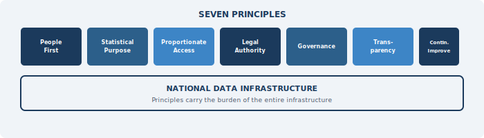

::: {.chapter-illustration}

:::

Chapter 4 mapped Pakistan's data landscape — statistical agencies, federal departments, provincial governments, private sector, academia — and identified the incentive problem at the heart of it: most data holders have no reason to share. But even if every data holder were willing to share tomorrow, that would not be enough. Before data flows, there must be agreement on the rules that govern those flows. This chapter sets out the core principles on which Pakistan's **National Data Infrastructure** should be built.

It is tempting to jump straight to the technical architecture — the databases, the linkage systems, the access platforms. But international experience makes clear that the most consequential decisions in building a data infrastructure are not technical. They are about values. What is the system for? Who does it serve? What does it protect? And who is accountable when things go wrong? Without clear answers to these questions, even well-designed technical systems tend to drift toward purposes they were not built for, or collapse under the weight of public mistrust.

The World Bank's 2021 World Development Report called for a "new social contract for data" — one grounded in the principles of value, trust, and equity. It argued that technical systems alone cannot generate the public legitimacy that data infrastructure requires to function (World Bank, 2021). A similar argument runs through the OECD's Recommendation on Enhancing Access to and Sharing of Data, which emphasises that governance frameworks must come before data flows, not after (OECD, 2021). And the UN Fundamental Principles of Official Statistics (FPOS), adopted by the General Assembly in 2014, remain the most authoritative statement of what statistical systems owe to the societies they serve — professional independence, scientific rigour, and strict confidentiality of individual data (United Nations, 2014).

Pakistan's challenge is to translate these international commitments into operating principles that reflect local realities. The country does not have a comprehensive data protection law. It has no statutory framework for sharing administrative data across agencies for statistical purposes. Its statistical agencies lack the institutional authority to demand cooperation from data holders. And public trust in government handling of personal data is fragile, shaped by decades of experience in which citizen data was used more for surveillance and control than for service delivery.

> These conditions do not make principles irrelevant. They make them essential. Principles are not statements to be listed in documents. They carry the burden of the entire infrastructure. Technology, governance, and legal reform must be built on top of them.

## Starting from People

The first commitment of any data infrastructure must be to the individuals whose data it uses. This is not just an ethical requirement — it is a practical one. If people do not trust that their information will be handled responsibly, they will resist providing it. This resistance may take the form of survey nonresponse, avoidance of administrative registration, or political opposition to data sharing arrangements. Trust is the foundation, and without it the infrastructure has nothing to build on.

The UN Fundamental Principles are explicit on this point. Principle 6 states that individual data collected by statistical agencies for statistical compilation, whether referring to natural or legal persons, must be strictly confidential and used exclusively for statistical purposes (United Nations, 2014). This is not a suggestion. It is the bedrock compact between a statistical system and the people it measures: the data you give us will not be used to identify you, tax you, prosecute you, or embarrass you. It will be used only to produce aggregate statistics that help society understand itself.

In Pakistan, this compact is yet to be established in law or in practice. When NADRA shares CNIC data for voter verification or SIM registration, that is not a statistical use. When BISP's poverty registry is used to identify and exclude specific households from benefits, that is an administrative use, not a statistical one. There is nothing inherently wrong with these uses. But they are fundamentally different from what a statistical data infrastructure is meant to do. And if the public cannot tell the difference — if they believe that data shared for one purpose will inevitably leak into another — then the entire infrastructure loses credibility before it begins.

The privacy literature offers useful frameworks for thinking about this. Helen Nissenbaum's theory of contextual integrity argues that privacy is not about keeping information secret — it is about information flowing appropriately according to the norms and expectations that apply in a given context (Nissenbaum, 2004, 2010). When a citizen gives their address to NADRA for an identity card, the expectation is that it will be used for identification. When the same address shows up in a statistical poverty map, a different set of norms applies. Both uses may be legitimate, but the rules governing them — consent, access, purpose limitation — must be different. A data infrastructure that fails to maintain these distinctions will lose the trust it depends on.

What this means in practical terms is that the infrastructure must establish clear boundaries around statistical use. Individual-level records should be accessible only to authorised analysts working on approved statistical projects. Outputs should be aggregated and checked for disclosure risk before release. And the entire system should be governed by a principle of **data minimisation** — acquiring only the data items needed for a specific statistical purpose, at the level of detail that purpose requires, and retaining them only as long as necessary. Statistics Canada's approach of "necessity and proportionality" — assessing whether the sensitivity and volume of data requested is proportionate to the statistical purpose — offers a sensible model for how this discipline can work in practice (Bowlby, 2021).

## Purpose: Statistics as a Public Good

A data infrastructure can be built for many purposes — intelligence gathering, commercial exploitation, surveillance, or service delivery. The one proposed here has a specific purpose: the production of statistics for the common good. This needs to be stated clearly.

Statistics are different from other information products. They describe populations and patterns, not individuals. They are meant to inform rather than to identify, to measure rather than to monitor. And critically, their value increases when they are shared. Unlike a commercial dataset whose value depends on exclusive access, a statistical estimate of district-level poverty becomes more useful the more widely it is used — by planners, researchers, journalists, civil society, and citizens. This is what economists call a public good: non-rivalrous and non-excludable in consumption.

The UN FPOS captures this directly. Principle 1 states that official statistics are an indispensable element in the information system of a democratic society and must be compiled and made available on an impartial basis to serve the government, the economy, and the public (United Nations, 2014). The outputs of the infrastructure, in other words, must be open. This is not simply a matter of posting datasets on a website. It means designing the entire production chain — from data acquisition to statistical estimation to dissemination — with the understanding that the end product is a public resource. User needs should drive what statistics are produced, when, and at what level of detail.

For Pakistan, this principle has direct implications. The country's statistical outputs are often delayed, difficult to access, and inadequately documented. Even when surveys are completed, results are sometimes withheld or released only partially. The 2017 population census results generated significant controversy over delayed and partial publication. A National Data Infrastructure built on the principle that statistics serve the common good would require full and timely release of statistical products, with adequate documentation for users to assess their quality and limitations. It would also require PBS and provincial bureaus to actively engage users — researchers, policymakers, civil society organisations — in defining information priorities, rather than producing statistics in isolation and hoping someone finds them useful.

## Balancing Access and Protection

Perhaps the most difficult practical challenge in building a National Data Infrastructure is managing the tension between two goals: expanding access to data for statistical and research purposes, and protecting the confidentiality of the individuals and organisations whose data is being used. Every country that has built a serious data infrastructure has had to navigate this tension, and no country has done so perfectly.

The **Five Safes framework**, introduced in Chapter 3 as a model for structuring data access controls, is directly applicable here. Its five components — safe projects (is the use appropriate?), safe people (are the researchers trusted and trained?), safe settings (is the environment secure?), safe data (has identification risk been reduced?), and safe outputs (have results been checked for disclosure?) — allow controls to be calibrated across multiple dimensions rather than forcing an all-or-nothing choice between maximum access and maximum protection (Desai, Ritchie, & Welpton, 2016).

For Pakistan, this framework is particularly useful because it acknowledges that different data assets carry different risks. Aggregated economic data from the State Bank of Pakistan poses little disclosure risk and can be shared widely. Individual health records from DHIS2 require much stricter controls. A population census microdata file sits somewhere in between — valuable for research but requiring careful anonymisation and access management. The infrastructure must apply different levels of protection to different datasets, rather than treating all data the same.

The OECD's recommendation on data access makes a complementary point: restrictions on access should be proportionate to demonstrated risks, not based on blanket prohibitions (OECD, 2021). Many data holders, in Pakistan and elsewhere, default to restricting access entirely — not because they have assessed the risks and found them unacceptable, but because saying no is easier than managing access responsibly. A National Data Infrastructure built on sound principles would reverse this default. The starting point would be that relevant data should be accessible for approved statistical purposes, with risks identified, documented, and mitigated using appropriate safeguards.

## Governance That Works Across Boundaries

One of the hardest questions in any multi-source data infrastructure is governance. Who decides which data is included? Who approves access requests? Who monitors compliance? Who resolves disputes between data holders and data users? And critically, who is accountable when something goes wrong?

In a **blended data** environment — where data flows from NADRA, FBR, BISP, provincial departments, and private companies into a shared infrastructure — the governance challenge is fundamentally different from governing a single statistical agency. No single agency owns all the data. No single set of rules covers all the situations. And the incentives of different data holders are often misaligned.

The international literature on data governance has converged on several key insights. The British Academy and Royal Society argued that governance frameworks must be as much about building relationships and trust between organisations as about establishing rules and regulations (British Academy & Royal Society, 2017, p. 6). The World Bank called for integrated national data systems that bring diverse stakeholders into the governance structure (World Bank, 2021). And the U.S. Commission on Evidence-Based Policymaking recommended creating a dedicated coordination entity to facilitate data access across agencies while maintaining strict privacy protections (CEP, 2017).

What these frameworks share is a recognition that governance cannot be added after the infrastructure is built. It must be designed from the beginning. Pakistan already has a Governing Council (GC) of PBS that includes representatives from key government agencies and independent experts. PBS should work on developing common standards for metadata, data quality, and interoperability to be presented for approval through this council. This would help ensure that data from different sources can actually be combined. And it means creating clear processes for requesting access, approving projects, monitoring use, and sanctioning violations.

**Interoperability** deserves special emphasis. As Chapter 2 discussed, one of the most basic obstacles to blending data in Pakistan is that different agencies use different classification systems, different identifier formats, different geographic coding, and different data structures. Without common standards, even willing agencies cannot share data effectively. The general statistics laws of many countries require the national statistical office to set and enforce data standards across the system. Pakistan needs to work toward similar provisions. Building this function into the infrastructure governance framework is an essential early step.

## The Legal Foundation

Everything mentioned above — the privacy protections, the purpose limitations, the access frameworks, the governance structures — ultimately depends on law. In the absence of a legal basis, the infrastructure cannot compel data sharing, cannot enforce privacy protections, cannot protect the statistical independence of the agencies that operate it, and cannot offer data holders the legal certainty they need to participate.

Pakistan's current legal framework was not designed for this. The General Statistics (Reorganisation) Act of 2011 gives PBS authority to collect statistics and coordinate the national statistical system, but its provisions on data sharing across agencies are vague at best. There is no comprehensive data protection legislation comparable to the European Union's General Data Protection Regulation or even India's Digital Personal Data Protection Act of 2023. The Electronic Transactions Ordinance of 2002 addresses certain aspects of electronic data but is not a data protection law in any meaningful sense.

The legal gaps are not trivial. The Governing Council of PBS can help the bureau get cooperation from NADRA, FBR, or other agencies to share data for statistical purposes, but this process needs to be backed by a data protection law that provides a legal standard against which privacy safeguards can be measured. Without legal provisions for accrediting researchers and governing data access, there is no basis for operating research data centres or managing controlled access to microdata. And without legal protections for the statistical independence of data infrastructure operators, there is a risk that political pressure could influence which statistics are produced or how they are released.

International experience suggests that legal reform is not a one-time event but an evolving process. The United States has passed multiple pieces of legislation over several decades — from the Privacy Act of 1974 to the Confidential Information Protection and Statistical Efficiency Act (CIPSEA) of 2002 to the Foundations for Evidence-Based Policymaking Act of 2018 (U.S. Congress, 2019). Even so, significant legal obstacles remain, including restrictions on sharing tax data between statistical agencies that have resisted reform for over two decades (NASEM, 2023). Pakistan will need its own legislative journey, but it can learn from these experiences.

At a minimum, the legal framework should establish the **statistical purpose doctrine** — that data acquired through the infrastructure can only be used for statistical purposes and cannot be disclosed in identifiable form. It should provide clear authority for designated agencies to access administrative data held by other government bodies for approved statistical uses. It should establish legal protections for confidentiality that carry penalties for violations. And it should create the statutory basis for an independent governance body with authority to manage the infrastructure.

## Transparency as an Operating Principle

Transparency in a data system does not mean that all data should be open to everyone. In fact, much of the data will be confidential, and that is correct and necessary. What transparency means here is something more practical. The rules of the system should be clear and publicly available. Decisions about who can access data should be properly recorded and open to review. The methods used to produce statistics should be shared openly. And people should be able to see what kind of data is being used, who is using it, and for what purpose. This kind of transparency builds trust without compromising confidentiality.

It serves multiple functions. It allows external scrutiny, which helps identify problems before they become crises. It builds public trust, because people are more willing to accept data use when they can see how it is governed. It enables accountability, because decision-makers can be held responsible for the choices they make. And it disciplines the system itself — when officials know their decisions will be reviewed, they tend to make better ones.

The UN Fundamental Principles make a related point. Principle 3 states that statistical agencies must present information according to scientific standards on the sources, methods, and procedures of the statistics (United Nations, 2014). This is a commitment to methodological transparency — to letting users understand how the numbers were produced so they can assess their reliability. In a blended data environment, where statistics are produced by combining data from multiple sources using complex methods, this commitment is more important than ever. If a poverty estimate is produced by combining household survey data with satellite imagery and mobile phone records, the statistical agency must disclose how each source contributed, what assumptions were made, and what the limitations are. Without this, users cannot make informed judgments about the quality of what they are being given.

## Designing for Adaptation

A final principle concerns time. The data landscape is changing rapidly. New data sources emerge, new methods are developed, new privacy threats are discovered, and new policy needs arise. An infrastructure designed to be permanent and fixed will quickly become obsolete. An infrastructure designed to adapt will remain useful.

This is easy to say but difficult to build. Adaptation requires investment in people, not just technology. PBS needs staff trained in modern data science, who can evaluate new data sources, apply new linking and modelling techniques, and assess new privacy risks. Governance frameworks must be flexible enough to accommodate new types of data and new access arrangements without requiring legislative amendment every time. And the infrastructure must have mechanisms for learning — from its own experience, from international peers, and from the academic research community.

The OECD has emphasised this point in its digital government strategies, arguing that data governance frameworks should be flexible and adaptive rather than rigid and prescriptive (OECD, 2021). The NASEM panel similarly recommended that the U.S. data infrastructure should incorporate state-of-the-art practices and be designed for continuous improvement (NASEM, 2023). For Pakistan, where institutional reform tends to move slowly and the gap between current capacity and international best practice is large, the temptation will be to design the infrastructure for today's reality. But the infrastructure that is needed is one that can grow — that can start with what is feasible now and evolve as capacity, trust, and legal frameworks develop.

::: {.callout-note}
## Summary of Principles

The principles that should guide Pakistan's National Data Infrastructure can be summarised in seven commitments:

1. **People first.** The infrastructure must protect individuals from harm, preserve confidentiality, and earn public trust through responsible data practices.
2. **Statistical purpose.** Data accessed through the infrastructure must be used exclusively for producing statistics and evidence that serve the common good.
3. **Proportionate access.** Data sharing should be governed by a framework that balances access for approved purposes against protection of legitimate interests, calibrating controls to assessed risk.
4. **Clear legal authority.** The infrastructure must have a statutory basis that establishes its purpose, its powers, its governance, and the protections it affords to data subjects and data holders.
5. **Effective governance.** An inclusive governance framework with common standards, clear processes, and independent oversight must be in place before data begins to flow.
6. **Transparency.** The rules, methods, and decisions governing the infrastructure must be open to public scrutiny and external review.
7. **Continuous improvement.** The infrastructure must be designed for adaptation — capable of incorporating new data sources, new methods, and new safeguards as they become available.
:::

These principles define what the infrastructure must be. The next question is who makes it work. Chapter 6 addresses the institutional centrepiece of the argument: repositioning PBS from a data collection agency into the **national data coordinator** that a multi-source statistical system requires.

## References

Bowlby, G. (2021). Private sector administrative data and the Canadian statistical system. Presentation to the National Academies' Panel on the Scope, Components, and Key Characteristics of a 21st Century Data Infrastructure, December 9, 2021.

British Academy & Royal Society. (2017). *Data Management and Use: Governance in the 21st Century*. London.

Commission on Evidence-Based Policymaking. (2017). *The Promise of Evidence-Based Policymaking*. Washington, DC.

Desai, T., Ritchie, F., & Welpton, R. (2016). Five Safes: Designing data access for research. Working Paper, University of the West of England.

National Academies of Sciences, Engineering, and Medicine. (2023). *Toward a 21st Century National Data Infrastructure: Mobilizing Information for the Common Good*. Washington, DC: The National Academies Press.

Nissenbaum, H. (2004). Privacy as contextual integrity. *Washington Law Review*, 79(1), 119–158.

Nissenbaum, H. (2010). *Privacy in Context: Technology, Policy, and the Integrity of Social Life*. Stanford: Stanford University Press.

OECD. (2021). *Recommendation of the Council on Enhancing Access to and Sharing of Data*. Paris: OECD Publishing.

United Nations. (2014). Fundamental Principles of Official Statistics. General Assembly Resolution A/RES/68/261.

U.S. Congress. (2019). Foundations for Evidence-Based Policymaking Act of 2018. Public Law 115-435.

World Bank. (2021). *World Development Report 2021: Data for Better Lives*. Washington, DC: World Bank.
