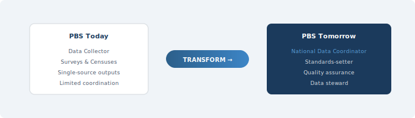

::: {.chapter-illustration}

:::

Chapter 5 set out seven principles for Pakistan's National Data Infrastructure — from people-first protections and statistical purpose to legal authority and continuous improvement. But principles need an institution to carry them. This chapter argues that the Pakistan Bureau of Statistics is the institution best positioned to serve as the **national data coordinator** — and examines what that transformation actually requires.

The Pakistan Bureau of Statistics was created in 2011 through the General Statistics (Reorganisation) Act, which merged the Federal Bureau of Statistics, the Population Census Organisation, and the Agricultural Census Organisation into a single entity. The intent was to consolidate the country's fragmented statistical functions under one roof and improve both efficiency and coordination. Over a decade later, the consolidation has happened on paper, but the deeper transformation has not. PBS still operates primarily as a data collection agency. It conducts surveys and censuses, processes data, and publishes results. That work is essential and should continue. But it is no longer enough.

The reason it is not enough has been the argument of every preceding chapter. The future of national statistics lies in **blending data** from multiple sources — surveys, administrative records, private sector data, digital sources — to produce outputs that are more timely, granular, and comprehensive than any single source can deliver. This is not a task any one agency can accomplish alone. It requires coordination across dozens of data holders, common standards that make data interoperable, quality frameworks that apply across the entire system, and governance arrangements that build trust among organisations with very different mandates and cultures. Someone has to play the coordinating role. In most countries that have modernised their statistical systems, that role falls to the national statistical office. In Pakistan, it should fall to PBS.

The UNECE Task Force on Data Stewardship, reporting in 2024, examined exactly this question — what role national statistical offices should play in the expanding data ecosystem. Their conclusion was clear: the transformation required is an overall paradigm shift, moving from the production of statistics to the provision of data and data-related services (UNECE, 2024, p. 5). Data stewardship, in this framing, means managing and coordinating interactions across the data system, operating in service of — rather than in control of — the data ecosystem (UNECE, 2024, p. 8). This is an important distinction. The goal is not for PBS to become a centralised data warehouse that owns all data. The goal is for PBS to become the institution that makes the system work — by setting standards, facilitating access, ensuring quality, and building the trust that data sharing requires.

## What PBS Is Today

To understand what needs to change, it helps to be honest about where things stand. PBS is headed by the Chief Statistician, who functions as the principal executive officer and reports to the Ministry of Planning, Development and Special Initiatives. The bureau's mandate under Section 3 of the 2011 Act covers the collection, compilation, analysis, and publication of statistics across economic, social, demographic, and environmental domains. It conducts the Population and Housing Census, the Labour Force Survey, the Household Integrated Economic Survey, the Pakistan Social and Living Standards Measurement Survey, and various other data collection exercises.

These are significant responsibilities, and PBS carries them out under considerable constraints. Budgets are limited. Field infrastructure is weak in many regions. The gap between data collection and publication is often more than a couple of years. And the 2011 Act, while granting PBS operational autonomy, does not give the Chief Statistician the kind of system-wide authority that would be needed to coordinate data activities across other federal agencies, let alone provincial governments and the private sector.

This last point is critical. In many countries, the chief statistician has explicit legal authority not only to lead the national statistical office but to coordinate the broader national statistical system. The UNECE Guidance on Modernising Statistical Legislation recommends that the chief statistician should lead the strategic development of the national statistical system and have authority over methods, standards, and procedures applied by all producers of official statistics (UNECE, 2018). In Canada, the Statistics Act gives the Chief Statistician personal responsibility for protecting confidentiality of individual records and full authority over programme priorities, including the power to approve all data collection forms used across government for statistical purposes (Statistics Canada, 2016). In Australia, the Australian Statistician has a legislated function to provide statistical services for state and territory governments and an explicit leadership role in maximising the use of public data for statistical purposes (ABS, 2020).

Pakistan's Chief Statistician has no comparable authority. The 2011 Act does not give PBS the power to set standards that bind other agencies. It does not give the Chief Statistician authority to approve or review data collection instruments used by line ministries. And it does not give PBS the legal basis to acquire administrative data from NADRA, FBR, BISP, or other federal agencies for statistical purposes — at least not with the compulsory authority that statistical offices in Canada, Australia, and the Nordic countries enjoy. Without this authority, coordination depends entirely on goodwill and ad hoc arrangements, which are inherently fragile.

## The Stewardship Model

The concept of data stewardship offers a useful framework for thinking about what PBS could become. As defined by the UNECE Task Force, a data steward is an entity that manages data on behalf and for the benefit of the whole society (UNECE, 2024). The stewardship role is distinct from both data ownership (holding data) and data production (creating statistics). It is about managing the system that connects them.

In practical terms, data stewardship involves several interconnected functions. The UNECE framework identifies at least four broad areas where national statistical offices can operate as stewards: governance and standards-setting, quality assurance across the system, data integration and infrastructure, and advisory services to other data holders (UNECE, 2024). Not every NSO needs to perform all of these functions, and the scope depends on institutional context. But for Pakistan, where the data landscape is fragmented and no other institution is well positioned to play this role, PBS is the natural candidate.

This does not mean PBS needs to do everything at once. The UNECE report is careful to emphasise that NSOs should proceed at their own pace and take on a stewardship role that fits their purpose and environment (UNECE, 2024). For a statistical office like PBS, which currently has limited capacity and no legal mandate for system-wide coordination, the transition would need to be gradual. But the direction should be clear from the start.

What does stewardship look like in countries that are further along? **Australia** offers one instructive example. The Australian Bureau of Statistics became the country's first Accredited Integrating Authority in 2012, giving it formal responsibility for managing high-risk data integration projects involving Commonwealth government data. Under this framework, ABS does not hold all the data centrally. Instead, it acts as the trusted intermediary — linking datasets from health, education, taxation, social services, and census records into integrated assets like the Person Level Integrated Data Asset (PLIDA), while maintaining strict privacy controls and governance oversight through a multi-agency project board (ABS, 2020). The model is built on the principle that the statistical office's credibility — its long track record of protecting confidentiality and maintaining methodological rigour — is what makes it the natural home for this coordination role.

**Canada** provides another model. Statistics Canada has developed an Administrative Data Inventory — a central repository of metadata on all administrative datasets received by the agency — to understand what data it holds, how each dataset is used, and where there are opportunities for better integration (Trépanier, 2013). This sounds like a mundane administrative task. It is not. An inventory is the foundation of coordination, because you cannot manage, standardise, or integrate data assets you do not know exist. Canada has also adopted an "administrative-data-first" policy, meaning that statistical programmes must first investigate whether existing administrative or alternative data sources can meet their needs before designing a new survey (Statistics Canada, 2019). This reduces respondent burden, saves costs, and gradually shifts the agency's culture from one centred on primary data collection to one centred on data management and integration.

## Knowing What Exists: The Inventory Function

One of the most basic but most neglected functions of a national coordinator is maintaining a comprehensive inventory of the country's data assets. In Pakistan, no such inventory exists. PBS knows what data it collects itself. But it has no systematic understanding of what data is held by NADRA, FBR, BISP, the State Bank, provincial health departments, NEPRA, PTA, or the dozens of other agencies and organisations that generate data as part of their operations.

This is not an unusual situation for developing countries. A PARIS21 survey of 59 national statistical offices in Africa, Latin America, and Asia-Pacific found that lack of information about existing data holdings was one of the most commonly cited barriers to coordination (PARIS21, 2021). You cannot share what you do not know you have. And agencies that do not know what data exists elsewhere in government will inevitably design new surveys to collect information that already exists in administrative systems — wasting resources and placing unnecessary burden on respondents.

Building an inventory is not a technology project. It is an institutional project. It requires a dedicated working group to systematically contact data-holding agencies across federal and provincial government, document what datasets they hold, what variables they contain, how they are collected and updated, what identifiers they use, what quality controls are applied, and under what legal authority the data is held. The Canadian experience suggests that this work should be led by a centralised function within the statistical office but involve extensive consultation with data-holding agencies, because much of the relevant knowledge resides with programme managers and IT staff, not in any central register (Trépanier, 2013).

For Pakistan, this effort should be led jointly by the Chief Statistician and the Chief Economist, working with an inter-agency Data Inventory Working Group that includes representatives from all major data-holding bodies. The inventory should cover federal agencies as well as provincial bureaus of statistics and key provincial departments. It should document not only the content of each dataset but also its potential **fitness for use** — including coverage, frequency of update, granularity, and any known quality issues. The inventory itself should be treated as a living document, updated regularly as new data sources emerge and existing ones change.

The result would be, for the first time, a comprehensive map of Pakistan's national data landscape. This map is a precondition for everything else — for identifying opportunities for data blending, for assessing where gaps exist, for prioritising investments in data quality improvement, and for designing the governance arrangements that will govern data sharing.

## Quality Across the System

When PBS produces a survey estimate, it can assess and report on the quality of that estimate because it controls the entire production process — from sample design to fieldwork to estimation. But in a blended data environment, many of the inputs to statistical production will come from outside PBS. Administrative data from tax authorities, health systems, or civil registration have their own quality characteristics — and their own quality problems. If PBS is to coordinate a system that blends these inputs, it must also take on a quality assurance function that extends beyond its own products.

This is a significant expansion of scope. The quality dimensions introduced in Chapter 3 — relevance, accuracy, timeliness, accessibility, coherence, comparability — were developed primarily for data that statistical agencies control. The quality assessment of administrative data, private sector data, and digital sources requires additional considerations, including fitness for purpose, representativeness relative to the target population, stability over time, and sensitivity to changes in the administrative process that generates the data. Chapter 7 develops a comprehensive quality framework for this multi-source environment. Here, the point is institutional: PBS must build the capacity to perform this function.

The UNECE has been developing guidance on quality frameworks for multi-source statistics, recognising that blended data environments require what might be called "input quality assessment" — evaluating the quality of data before it enters the statistical production process, not just after the final output is produced (UNECE, 2024). For PBS, this would mean developing quality criteria applicable to any data source that enters the national statistical system, regardless of its origin.

In practical terms, this function could begin with a Quality Assessment Working Group — a technically focused body that develops quality standards, creates assessment tools and templates, and works with data-holding agencies to evaluate the fitness of their data for statistical use. The key principle is that quality assessment should not be a one-time exercise. It should be an ongoing function that monitors input quality as the administrative processes that generate the data evolve.

## Making It Worth Their While

Perhaps the single most important insight from international experience is that coordination cannot be imposed from above alone. It must also be incentivised. Data-holding agencies will share their data with PBS, and tolerate the costs and risks of doing so, only if they see tangible value in return. This is what distinguishes a functioning data infrastructure from one that exists on paper.

The principle of reciprocity is well established in the international literature. The NASEM panel argued that data sharing must be structured so that all data holders enjoy tangible benefits from participation and that societal benefits are proportionate to the costs and risks involved (NASEM, 2023, p. 29). Statistics Canada has long pursued what it calls a "win-win partnership" approach — seeking mutually beneficial arrangements with data holders rather than relying solely on legal compulsion, even though the Statistics Act gives the agency compulsory access powers (Statistics Canada, 2016). The reason is practical: legal authority is necessary but not sufficient. Agencies that feel coerced will share data reluctantly, with minimal cooperation on quality improvement and metadata documentation. Agencies that see value in the relationship will actively support it.

What does value look like from the perspective of a data holder? For NADRA, value might mean receiving back improved demographic estimates that help it plan registration drives. For FBR, it might mean aggregated economic indicators at a level of detail that helps target enforcement efforts. For provincial health departments, it might mean integrated health-and-poverty statistics that help allocate resources more effectively. For BISP, it might mean independent quality assessments of its registry data that improve targeting accuracy.

> This requires information to flow in both directions — from data holders to PBS and from PBS back to data holders and the public. The traditional model, in which data flows one way, does not create the feedback loops needed to sustain a multi-party system.

The infrastructure must be designed so that every contributor sees the output. When data holders see how their data contributes to better statistics, and when they receive useful analytical products in return, the case for continued sharing becomes self-reinforcing.

## The Institutional Prerequisites

Repositioning PBS from a data collector to a national coordinator is not primarily a technical challenge. It is an institutional one. Several conditions need to be in place.

**First**, the Chief Statistician's role must be elevated. In countries with effective statistical coordination, the chief statistician is typically at the most senior level of the civil service — equivalent to a deputy minister or permanent secretary — with direct access to cabinet-level officials and inclusion in regular meetings of senior government leaders. In Canada, the Chief Statistician holds a rank equivalent to Deputy Minister and attends all routine meetings of deputy ministers, giving the position both visibility and influence (Statistics Canada, 2016). This is not a matter of personal prestige. It is about ensuring that the person responsible for coordinating the national data system has the institutional standing to engage as an equal with the heads of agencies like NADRA, FBR, and the State Bank. PBS's current position as an attached department of the Ministry of Planning limits the Chief Statistician's authority and visibility.

**Second**, the legal framework must be reformed. The 2011 Act needs to be updated — or supplemented by new legislation — to give PBS explicit authority to coordinate the national statistical system, to set standards for data quality and interoperability that bind other agencies, to access administrative data held by government bodies for approved statistical purposes, and to protect the confidentiality of all data that enters the system. Without legal authority, coordination remains voluntary, and voluntary coordination in government rarely survives changes in leadership or political priorities. As Chapter 5 discussed, the UNECE Guidance on Modernising Statistical Legislation is clear that system-wide coordination authority should have an explicit basis in the law itself (UNECE, 2018).

**Third**, PBS needs new capabilities. Coordinating a multi-source data system requires skills different from those needed for traditional survey work. PBS needs staff who can negotiate data-sharing agreements, assess the quality of administrative data, link records across different datasets, apply privacy-enhancing technologies, manage secure data environments, and communicate effectively with non-statistical agencies. Building these capabilities will take years and will require sustained investment in recruitment, training, and institutional development. International partnerships — with statistical offices in Canada, Australia, the Netherlands, and elsewhere — can help accelerate this process, but they cannot substitute for domestic capacity building.

**Fourth**, governance structures must be established. The repositioning of PBS should be accompanied by the creation of a **National Statistical Coordination Committee** — a high-level body chaired by the Chief Statistician and including senior representatives from all major data-holding agencies, provincial bureaus of statistics, and independent experts. This committee would advise on priorities, approve data-sharing arrangements, and monitor the implementation of data quality standards across the system. The PARIS21 guidelines on national strategies for statistical development emphasise that coordination committees are essential for building consensus around statistical priorities and for ensuring that the system responds to the needs of both government and the public (PARIS21, 2007).

## Starting Somewhere

The transformation described here is large. It will take many years to complete. But it does not require all pieces to be in place before anything can begin. Some actions can be taken immediately, within PBS's existing mandate and resources.

The data inventory effort can begin now. PBS can start cataloguing the administrative data sources it already knows about, and gradually expand the scope as it establishes relationships with other agencies. The quality assessment function can start modestly — perhaps by developing quality profiles for the two or three administrative datasets most likely to be used in near-term blending exercises. Pilot data-sharing arrangements with willing agencies — BISP and NADRA are obvious candidates — can demonstrate value and build trust before comprehensive legal reform is achieved. And the Chief Statistician can begin convening regular meetings with counterparts in other data-holding agencies, even informally, to build the relationships that coordination depends on.

The UNECE Task Force puts it well: data stewardship is not an all-or-nothing proposition. NSOs can start with what is feasible and relevant given their current context, resources, and mandate, and expand their role incrementally as trust, capacity, and legal frameworks develop (UNECE, 2024). For PBS, the journey from data collector to national coordinator will be long. But the first steps are both clear and achievable.

::: {.callout-note}
## The Core Shift

The repositioning of PBS is ultimately about a change in institutional identity. PBS must come to see itself — and be seen by others — not as the agency that conducts surveys and censuses, but as the agency that makes Pakistan's national data system work. It retains its production role. But it adds to it a coordination role, a quality assurance role, a standards-setting role, and a facilitation role that together make it the steward of a National Data Infrastructure far larger than anything PBS could build alone.
:::

But coordination without quality assurance is coordination built on sand. If PBS is to blend data from dozens of sources — each with different origins, different purposes, and different limitations — it must be able to assess whether each source is fit for the statistical purpose it is being put to. Chapter 7 develops the quality framework that this requires.

## References

Australian Bureau of Statistics. (2020). The role of the Australian Bureau of Statistics in data governance and stewardship in Australia. Analytical Series. Canberra: ABS.

Federal Committee on Statistical Methodology. (2020). *A Framework for Data Quality*. Washington, DC: FCSM.

National Academies of Sciences, Engineering, and Medicine. (2023). *Toward a 21st Century National Data Infrastructure: Mobilizing Information for the Common Good*. Washington, DC: The National Academies Press.

PARIS21. (2007). *A Guide to Designing a National Strategy for the Development of Statistics (NSDS)*. Paris: PARIS21 Secretariat.

PARIS21. (2021). *Coordination Capacity in National Statistical Systems: Background Report*. Paris: PARIS21 Secretariat.

Statistics Canada. (2016). Leadership and coordination of the national statistical system. In *Management of Statistical Information Systems at Statistics Canada*. Ottawa.

Statistics Canada. (2019). *Statistics Canada Data Strategy*. Ottawa: Statistics Canada.

Trépanier, J. (2013). Administrative data initiatives at Statistics Canada. Paper presented at the Federal Committee on Statistical Methodology Research Conference, Washington, DC.

UNECE. (2018). *Guidance on Modernizing Statistical Legislation*. Geneva: United Nations Economic Commission for Europe.

UNECE. (2024). *Data Stewardship and the Role of National Statistical Offices in the New Data Ecosystem*. Geneva: United Nations Economic Commission for Europe.
