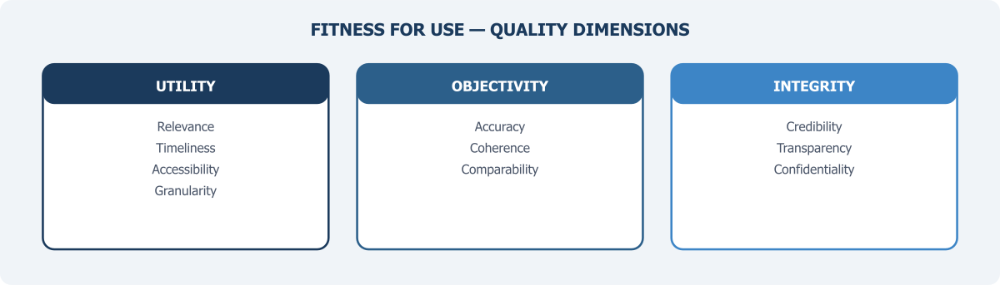

::: {.chapter-illustration}

:::

Chapter 6 argued that PBS must take on a quality assurance function that extends well beyond its own survey products — assessing the fitness of administrative data, private sector data, and other sources before they enter the national statistical system. This chapter develops the quality framework that function requires.

The phrase "fitness for use" entered the quality literature through the work of Joseph Juran, who in the 1950s argued that quality should not be defined by abstract technical standards but by the degree to which a product actually serves the purpose for which it was intended (Juran, 1988). The idea was developed for manufacturing — a component is high-quality if it performs its function reliably. Statistical agencies worldwide have since adopted this thinking, and for good reason: not all data that can be collected should be used for national statistics, and no dataset is universally good or bad. Quality depends on the specific question being asked, the methodology used to generate the data, and the context in which the data will be used. A dataset that is perfectly adequate for one purpose — say, monitoring programme disbursements — may be entirely inadequate for another, such as estimating the number of poor households in a district.

This matters enormously for Pakistan's **National Data Infrastructure**. As earlier chapters have argued, the future of national statistics lies in blending data from multiple sources, each created for a different purpose, by a different institution, using different methods and definitions. Some will be useful for statistical production. Others will not. And many will be useful only partially or conditionally — suitable for some purposes but not others, adequate in some dimensions but weak in others. The task is not to apply a single pass/fail test to each dataset. It is to develop a systematic way of assessing quality that is sensitive to purpose, transparent about limitations, and practical enough to be applied across a wide range of data sources.

## Why Traditional Quality Frameworks Are Not Enough

For most of the twentieth century, the dominant approach to data quality in statistics was built around the survey. The Total Survey Error (TSE) framework, formalised by Biemer (2010) and others, provided a rigorous way to think about the errors that can affect survey-based statistics — sampling error, coverage error, nonresponse error, measurement error, and processing error. Each source of error was well understood theoretically, and statistical agencies developed sophisticated methods for estimating and controlling them. The quality of a survey could be evaluated by examining its response rate, sample design, fieldwork protocols, and estimation procedures.

This framework works well when the statistical office controls the entire production process. But it was not designed for administrative data, private sector data, or digital data, because these sources were not created through a statistical process at all. Administrative records are generated as a byproduct of government operations: tax filing, hospital admissions, border crossings, benefit payments. The data reflects whatever the administrative process was designed to capture, which may or may not correspond to the statistical concept the analyst is interested in. There is no sampling frame — the data covers the population defined by institutional rules rather than by statistical design. Coverage depends on programme reach and compliance behaviour, not on sample theory. And the metadata that surveys routinely generate — documentation of concepts, definitions, response rates, estimation methods — often does not exist for administrative data, or exists only in fragmented form.

The NASEM panel on 21st-century data infrastructure recognised this gap directly. Their recommendation was that federal statistical agencies should adopt a broader framework than TSE, one that includes dimensions like timeliness, relevance, accessibility, coherence, integrity, privacy, transparency, and interpretability (NASEM, 2017, p. 157). The Federal Committee on Statistical Methodology (FCSM) followed up in 2020 with a comprehensive data quality framework organised around three broad domains — utility, objectivity, and integrity — designed to apply to all types of data, including data collected for nonstatistical purposes such as administrative records and sensors (FCSM, 2020, p. 3). Chapter 3 introduced this framework's 11 quality dimensions when discussing the requirements for **blended data**. Here we examine how to apply them in practice.

Most recently, Berzofsky et al. (2025) proposed a Total Data Quality paradigm that explicitly extends TSE to administrative and non-probability data sources, identifying error types specific to these sources — definitional mismatch, process change error, and reporting incentive error — that have no direct analogue in survey methodology.

For Pakistan, this shift in thinking is not academic. If PBS is going to incorporate administrative data from NADRA, FBR, BISP, the State Bank, EAD, or provincial health departments into statistical production, it needs a quality framework that can assess these sources on their own terms — not one that simply asks whether they meet the standards of a well-designed probability survey.

## What Quality Means for Different Data Sources

Quality is not a single dimension but a collection of dimensions, and the relative importance of each depends on the intended use. The European Statistical System (ESS) identifies six principal dimensions: relevance, accuracy, timeliness, accessibility, coherence, and comparability (Eurostat, 2019). The FCSM framework adds transparency, privacy protection, and interpretability (FCSM, 2020). These dimensions provide a useful vocabulary. But the vocabulary alone is not enough. The challenge is applying them concretely to the diverse data sources that Pakistan's infrastructure will need to accommodate.

Consider some examples. When PBS conducts the Labour Force Survey, quality can be assessed against well-established survey criteria — sample representativeness, response rate, questionnaire consistency, weighting procedures. These questions have standard answers in the survey methodology literature.

But when the question is whether FBR's tax records can be used to estimate formal sector employment, the relevant quality dimensions shift entirely. What population does the tax system actually cover? Only formal sector workers and registered businesses — a fraction of Pakistan's largely informal economy. Are the income categories in tax records consistent with the income concepts used in national accounts? Often not, because tax definitions serve fiscal purposes, not statistical ones. How stable is the data-generating process? Tax compliance behaviour changes in response to policy announcements, amnesty schemes, and enforcement campaigns, creating instability in the data even when the underlying economic reality has not changed.

Similarly, DHIS2 data from provincial health departments may be highly relevant for tracking healthcare utilisation — visits, vaccinations, facility deliveries — but its accuracy depends on whether facility staff enter data correctly and consistently. Coverage depends on which facilities report and which do not. Timeliness may be excellent, since data is entered close to the point of care, but coherence across provinces may be poor if different provinces use different definitions or reporting categories for the same indicator.

NADRA's CNIC database covers nearly the entire adult population, making it potentially valuable as a population frame. But its quality for statistical purposes depends on how frequently addresses are updated, whether deceased individuals are removed promptly, and whether the data structure allows linkage with other sources using common identifiers.

Each of these sources has real value for statistical production. But each also has specific quality limitations that must be understood before the data can be used. The critical point is that quality assessment must be **source-specific and purpose-specific**. A blanket statement that a dataset is "high quality" or "low quality" is almost always misleading.

## The Metadata Problem

If there is a single prerequisite for quality assessment, it is metadata — structured information about how data was collected, what concepts and definitions were used, what the data covers, and what its known limitations are. Without adequate metadata, it is literally impossible to assess whether a dataset is fit for a particular statistical purpose. You cannot evaluate coverage if you do not know who was supposed to be in the data. You cannot assess accuracy if you do not know how variables were defined and measured. You cannot judge coherence if you do not know whether two apparently similar variables from different sources actually mean the same thing.

For survey data produced by PBS, metadata is generally available because it is a standard part of the statistical production process. Survey methodology reports document sample design, response rates, definitions, and estimation methods. But for administrative data, the situation is typically much worse. Administrative systems are built to support operational processes, not to produce statistics. Their documentation — if it exists — describes procedures for data entry, not concepts and definitions in the statistical sense. There is rarely any information about coverage gaps, measurement quality, or changes in the data-generating process over time.

This is not unique to Pakistan. The Statistics New Zealand framework for administrative data quality — one of the most influential in the international literature — was developed precisely because the agency found that existing quality frameworks did not adequately address the metadata gaps that arise when administrative data is repurposed for statistics (Reid, Zabala & Holmberg, 2017). Their framework emphasises what they call "fitness for purpose assessment," which begins with a detailed investigation of how the data was generated, what rules and processes govern it, and how those have changed over time. This investigation typically requires working closely with the data-holding agency, because much of the relevant information exists only as institutional knowledge — in the heads of programme managers and IT staff — rather than in formal documentation.

For Pakistan, addressing the metadata deficit should be an early priority. Any data-sharing agreement between PBS and an administrative data holder should include a requirement that the data holder provide — or work with PBS to develop — a standardised metadata report covering: the legal basis for data collection, the population covered, variable definitions, the frequency and method of data collection, known coverage gaps, and any recent or planned changes to the data-generating process. This is not onerous. But it is essential. Without it, PBS would be incorporating data into the national statistical system without knowing what that data actually represents.

## Quality Assessment in Practice

How should PBS actually assess the quality of data sources it plans to use? The literature offers several approaches, and no single one is universally best. But a practical approach for Pakistan might combine elements from three established frameworks.

**The first** is the FCSM framework's three-domain structure. Under this approach, each data source is evaluated against three broad categories: utility (is the data relevant, timely, and accessible?), objectivity (is the data accurate, reliable, and coherent with other sources?), and integrity (was the data produced through a process that protects against manipulation, maintains confidentiality, and operates transparently?) (FCSM, 2020). This structure has the advantage of being comprehensive while remaining relatively simple to communicate.

**The second** is the input quality approach advocated by the UNECE for multi-source statistics. In this approach, quality is assessed at the point where data enters the statistical production process — before it is blended with other sources — rather than only at the point of final output (UNECE, 2024). This is critical because errors in input data propagate through the entire production chain. If FBR tax data systematically undercounts informal sector workers, no amount of sophisticated statistical modelling can fully correct for that coverage gap in the final estimates. Input quality assessment forces the analyst to identify and document these limitations early, so that they can be addressed — or at least disclosed — before the data is used.

**The third** is the concept of a **quality profile** — a standardised document that summarises the quality characteristics of a particular data source across all relevant dimensions. Quality profiles were pioneered by Statistics Canada and have been adopted by several other agencies (Statistics Canada, 2019). The profile for each data source answers a common set of questions: What population does this data cover? How is it collected and updated? What are the known quality strengths and limitations? How has the data-generating process changed over time? The profile is updated periodically and made available to all users of the data — both within the statistical agency and to external researchers.

For Pakistan, a practical starting point would be to develop quality profiles for the five or six administrative data sources most likely to be used in near-term data blending exercises — NADRA's CNIC database, FBR's tax records, BISP's beneficiary registry, SBP's financial sector data, and DHIS2 health data are obvious candidates. Each profile would be developed jointly by PBS and the data-holding agency, and would serve as the basis for decisions about how — and whether — to incorporate the data into statistical production.

## A Quality Challenge Specific to Pakistan

All countries face data quality challenges when incorporating non-survey sources into official statistics. But Pakistan faces some additional obstacles that deserve specific attention.

**The first is the sheer scale of informality.** Pakistan's informal economy accounts for a very large share of economic activity and employment. This means that any administrative data source that depends on formal registration — tax records, social insurance records, corporate registries — will systematically exclude a large portion of the population and the economy. This is a coverage problem, but it is also a conceptual problem: the population captured by administrative systems is not a random subset of the target population but a systematically selected one. Ignoring this selection when using the data for statistics will produce biased results.

**The second is the weakness of civil registration.** WHO estimates indicate that only approximately 40 per cent of births and 35 per cent of deaths are registered in Pakistan, and virtually no death registrations include medically certified cause of death (Bashir, Mehmood & Samad, 2025). This means that vital statistics are derived almost entirely from household surveys and censuses, not from administrative records. It also means that one of the most fundamental building blocks of a population register — a comprehensive record of births and deaths — does not exist. Until civil registration coverage improves substantially, Pakistan's data infrastructure will lack the demographic foundation that countries with strong civil registration and vital statistics (CRVS) systems take for granted.

**The third is inconsistency across provinces.** After the 18th Amendment, many statistical and administrative functions were devolved to the provinces. This has created a situation where different provinces may use different definitions, classifications, and reporting formats for the same indicators. Health data is a good example — the indicators reported through DHIS2 may differ across provinces in terms of which conditions are tracked, how severity is classified, and how facility-based data is aggregated. For PBS, achieving coherence — one of the core quality dimensions — requires not just assessing individual data sources but also harmonising definitions and classifications across provincial systems. Chapter 4 flagged this fragmentation as a systemic issue; here, it appears as a quality assurance problem that PBS must actively manage.

**The fourth is the absence of a data quality culture across government.** In countries with mature statistical systems, data-holding agencies understand that the quality of their administrative records matters not only for their own operations but for the national statistical system as a whole. In Pakistan, this awareness is largely absent. Agencies that generate administrative data do not typically think of themselves as contributors to national statistics, and they have little incentive to invest in the metadata documentation, quality monitoring, and standardisation that statistical use requires. Building this awareness — through engagement, training, and demonstration of value, as Chapter 6 discussed under the principle of reciprocity — is as important as any technical quality framework.

## FAIR Principles as a Complementary Framework

The quality dimensions discussed above address whether data is fit for statistical use. A related but distinct question is whether data is managed in a way that makes it findable, accessible, interoperable, and reusable — the four attributes captured by the FAIR principles, first articulated by Wilkinson et al. (2016) in the context of scientific data management.

The FAIR principles were not developed for official statistics. They emerged from the scientific research community, where the challenge was enabling researchers to discover and reuse datasets created by others. But the underlying problems are remarkably similar to those facing Pakistan's data infrastructure. Data that cannot be found — because it is not catalogued, not described with adequate metadata, or not registered in any central inventory — cannot be assessed for quality, let alone used. Data that is not accessible — because legal arrangements, technical systems, or institutional gatekeeping prevent access — remains locked in silos regardless of its quality. Data that is not interoperable — because different agencies use different classification systems, identifier formats, or data structures — cannot be combined even when access is granted. And data that is not reusable — because it lacks the documentation that would allow someone outside the originating agency to understand and use it correctly — will either go unused or be used incorrectly.

Adopting FAIR as a complementary framework does not mean that all government data should be openly published. The FAIR principles are explicit that "accessible" does not mean "open" — data can be FAIR while still being subject to access controls, authentication, and legal restrictions. What FAIR requires is that the existence and characteristics of data are documented and discoverable, that the conditions for access are clearly stated, that formats and standards enable combination across sources, and that documentation is sufficient to support correct reuse.

For Pakistan, FAIR principles translate into concrete infrastructure requirements: a national data catalogue (as discussed in Chapter 6's treatment of the inventory function), standardised metadata schemas, common classification systems, and interoperable identifier formats. These are not glamorous investments, but they are the plumbing without which a multi-source data system cannot function.

## Building the Quality Function

Quality assessment is not a one-time activity. It is an ongoing institutional function that requires dedicated staff, clear procedures, and sustained investment. As Chapter 6 recommended, PBS should establish a dedicated data quality unit — or expand an existing one — with the mandate to assess the fitness for use of all data sources that enter the national statistical system, to develop and maintain quality profiles for each source, to work with data-holding agencies on metadata documentation and quality improvement, and to publish regular quality reports available to users both inside and outside government.

This function should be guided by a formal quality framework — adapted from the FCSM and ESS models but calibrated to Pakistan's specific context and capacity constraints. The framework should be developed through a consultative process involving PBS, provincial bureaus of statistics, data-holding agencies, and external experts. It should be published as a public document so that users of Pakistan's statistics can understand the standards against which data quality is assessed.

The ultimate goal is not perfection. No data source is perfect, and no country achieves perfect data quality. The goal is transparency — ensuring that the strengths and limitations of every data source are documented, disclosed, and taken into account when the data is used for statistical production. A system that is honest about its data quality is more trustworthy than one that claims its data is good without evidence to support the claim.

::: {.callout-note}
## The Quality Imperative

Data quality is not a technical afterthought to be addressed once the infrastructure is built. It is the infrastructure. A multi-source statistical system that cannot assess the fitness of its inputs is building on sand. For Pakistan, the priority is to develop the institutional capacity, frameworks, and habits that make quality assessment a routine part of statistical production — applied not only to PBS's own surveys but to every data source that enters the national system.
:::

With the principles established (Chapter 5), the institutional home identified (Chapter 6), and the quality framework defined (this chapter), the foundations of a National Data Infrastructure are in place. The next challenge is one that will define whether this infrastructure remains relevant for decades or becomes obsolete within years: preparing for the demands of artificial intelligence and the data foundations it requires.

## References

Bashir, F., Mehmood, M. T., & Samad, Z. (2025). A systems-change approach to addressing the mortality surveillance gap in Pakistan. *Journal of Global Health*, 15, 03027.

Berzofsky, M. E., Liao, D., Barnett-Ryan, C., & Smith, E. L. (2025). A total data quality paradigm for official statistics based on administrative data. *Big Data & Society*, 12(1).

Biemer, P. P. (2010). Total survey error: Design, implementation, and evaluation. *Public Opinion Quarterly*, 74(5), 817–848.

Eurostat. (2019). *Quality Assurance Framework of the European Statistical System* (Version 2.0). Luxembourg: European Commission.

Federal Committee on Statistical Methodology. (2020). *A Framework for Data Quality* (FCSM-20-04). Washington, DC: FCSM.

Juran, J. M. (1988). *Juran's Quality Control Handbook* (4th ed.). New York: McGraw-Hill.

National Academies of Sciences, Engineering, and Medicine. (2017). *Federal Statistics, Multiple Data Sources, and Privacy Protection: Next Steps*. Washington, DC: The National Academies Press.

Reid, G., Zabala, F., & Holmberg, A. (2017). Extending TSE to administrative data: A quality framework and case studies from Stats NZ. *Journal of Official Statistics*, 33(2), 477–511.

Statistics Canada. (2019). *Statistics Canada Data Strategy*. Ottawa: Statistics Canada.

UNECE. (2024). *Data Stewardship and the Role of National Statistical Offices in the New Data Ecosystem*. Geneva: United Nations Economic Commission for Europe.

Wilkinson, M. D., Dumontier, M., Aalbersberg, I. J., et al. (2016). The FAIR Guiding Principles for scientific data management and stewardship. *Scientific Data*, 3, 160018.
