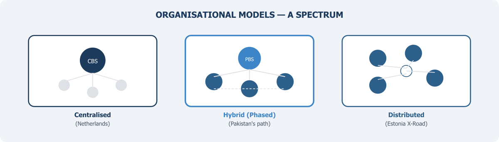

::: {.chapter-illustration}

:::

Chapter 7 established that a **National Data Infrastructure** must have a rigorous quality framework — one that assesses the fitness for use of every data source before it enters the statistical system. But quality frameworks do not enforce themselves. They need an organisational home: institutions with the mandate, authority, and legitimacy to coordinate data access, set standards, make decisions about linkage and sharing, and be held accountable. This chapter examines the organisational options available to Pakistan.

There is no single correct organisational model for a national data infrastructure. This is a statement that appears in nearly every major report on the subject, and it is worth taking seriously. Different countries have arrived at different arrangements, shaped by their legal traditions, political structures, and the capacities of their existing institutions. Pakistan will need to find the model that fits its own context. But it will benefit from understanding what has been tried elsewhere, what has worked, and why.

Organisational design may seem a technical question — drawing an organogram, assigning responsibilities, and moving on. But in the context of data infrastructure, organisational form is deeply political. It involves questions about who gets access to whose data, under what conditions, with what safeguards, and subject to whose oversight. These are questions of power, trust, and institutional legitimacy. Such infrastructure requires not only technical capabilities but also a legal and regulatory framework that clearly defines which data assets can be shared, with whom, and for what purposes (NASEM, 2023). In a country like Pakistan, with a highly fragmented statistical system, these questions are especially difficult. The 18th Amendment devolved many statistical functions to the provinces, while PBS retains a federal coordination mandate that, in practice, lacks the authority and resources to be fully effective — a constraint that Chapter 6 discussed at length. Any organisational model must be designed with this constitutional reality firmly in mind.

## Lessons from Centralised and Distributed Architectures

Before examining Pakistan's specific options, it is instructive to observe the range of approaches that countries have taken, because these reveal something important: institutional design follows from context, not from theory.

At one end of the spectrum sits the fully centralised model. Statistics Netherlands (CBS) developed the System of Social Statistical Datasets (SSD), a centralised data library in which administrative registers from across government are linked at the individual level using unique personal identification numbers. This infrastructure enabled the Netherlands to conduct its 2001 census entirely from registers and surveys, without traditional field enumeration — the so-called "virtual census" (Bakker, van Rooijen and van Toor, 2014). The Dutch model works because CBS has clear legal authority to access administrative data, a mature population register infrastructure, and decades of experience in record linkage. It also works because the Netherlands is small, highly digitalised, and characterised by strong institutional trust. None of these conditions obtain in Pakistan, which makes the fully centralised model instructive as an aspiration but impractical as a starting point.

At the opposite end sits the distributed model. Estonia's X-Road, launched in 2001, is a decentralised data exchange layer connecting over 900 public and private sector institutions, enabling secure real-time data queries across government databases without centralising data storage. Each agency maintains its own systems and controls access to its own data. The architecture was deliberately designed to avoid creating a single database that could become a vulnerability — a decision shaped by a major data leak in 1996 when a government contractor compiled and sold a "superdatabase" of personal records from multiple government sources (Vassil, 2016). What makes X-Road work is not just technology but a combination of universal digital identity, legal mandates for data exchange, and high digital literacy. For Pakistan, the distributed principle seems attractive — organisations reluctant to surrender data might be more willing to share it through a controlled platform. But the enabling conditions are only partially present. NADRA's CNIC system provides a foundation for identity, but much else — legal interoperability mandates, consistent digital standards, institutional trust — remains to be built.

The honest conclusion from international experience is that most functioning data infrastructures are hybrids. They combine a lead coordinating agency with distributed data holdings, shared governance mechanisms, and specialised entities for particular functions. The question for Pakistan is what form the hybrid should take, given the country's particular institutional constraints.

## Why Legal Authority Must Come First

The United Kingdom's experience is particularly instructive here — not because the UK model can be transplanted directly, but because it illustrates a sequencing principle that Pakistan should take seriously: legal authority must precede institutional design.

The UK's Digital Economy Act 2017 created specific legal gateways for public authorities to share de-identified information with accredited researchers for public-good research. The Act also established the accreditation framework — administered by the UK Statistics Authority — for researchers, projects, and processing environments, structured around the **Five Safes framework** (Ritchie, 2017). Only after this legal foundation was in place did the UK build its major data infrastructure investment: Administrative Data Research UK (ADR UK), established in 2018 with £44 million from the Economic and Social Research Council. ADR UK operates as a partnership between the Office for National Statistics (ONS) and three national partnerships in Scotland, Wales, and Northern Ireland. ONS serves as the main infrastructure partner, operating the Secure Research Service where linked administrative datasets are made available to accredited researchers. Crucially, ADR UK chose to build on an existing trusted institution rather than creating an entirely new one. As the programme's leadership noted, government and the public already trusted ONS to handle administrative data safely and securely (ADR UK, 2020).

Two lessons emerge. First, without legislation that creates clear data-sharing gateways with appropriate safeguards, any organisational model will operate in a legal grey zone that breeds caution and non-cooperation. Pakistan's General Statistics (Reorganisation) Act 2011 empowers PBS to access records maintained by government departments, but this is not the same as a comprehensive data-sharing framework with defined conditions, safeguards, and accountability mechanisms for the routine flow of administrative data into the statistical system. Equivalent legislation — establishing the Pakistani version of the governed data access framework that Chapter 5 outlined in its seven principles — is a prerequisite for whatever organisational form is ultimately chosen.

Second, building on institutions that already possess public trust is more effective than starting from scratch. This has direct implications for the question of PBS.

## The Question of PBS

The most natural starting point is to strengthen PBS itself as the central coordinating institution. This builds on existing legal authority, an established institutional identity, and relationships with international organisations. And it avoids the political complexity of creating new statutory bodies.

But the gap between PBS's formal mandate and its actual capacity is wide. The World Bank's 2025 assessment noted that PBS needs significant infrastructure and capacity upgrades, that provincial bureaus remain weak with limited technical and institutional capacity, and that coordination between federal and provincial nodes lacks frameworks for data sharing and quality assurance (World Bank, 2025). PBS operates with roughly 73 per cent of its sanctioned posts filled, with acute shortages at senior technical grades — only 6 out of 17 BS-20 positions were occupied at the time of assessment.

The 2019 decision to abolish the Statistics Division and place PBS under the Ministry of Planning further complicated matters. Recent commentators have argued that this move, by placing the producers of statistics under a line ministry, violated the spirit of sound statistical governance and made PBS vulnerable to political pressure on everything from GDP figures to livestock counts (Javed, 2025). The call to restore the 2011 Act's intent and strengthen the Chief Statistician's authority — already developed in Chapter 6 as a core institutional prerequisite — is not merely an academic argument. It is a precondition for PBS to credibly serve as the institutional anchor for a multi-source data infrastructure.

India's experience is relevant here, given the similarities in scale, complexity, and federal structure. India's Ministry of Statistics and Programme Implementation (MoSPI) operates the National Statistical Office (NSO), which combines the Central Statistical Office with the National Sample Survey Office. An independent National Statistical Commission provides oversight. Below the federal level, each state maintains its own Directorate of Economics and Statistics. A 2025 conference of state ministers on strengthening statistical systems highlighted both the aspiration for better coordination and the continuing challenge: most states requested technical assistance and training from MoSPI while calling for greater financial support (MoSPI, 2025). What India demonstrates is that in large federal systems, coordination depends not only on institutional design at the centre but on sustained investment in subnational capacity. Achieving coherence across states requires continuous political and bureaucratic engagement. For Pakistan, the implication is that strengthening PBS alone is insufficient — there must be parallel investment in provincial bureaus, with incentives for voluntary participation in a coordinated system.

For PBS to serve as the institutional home for a multi-source data infrastructure, it would need at minimum: restoration and strengthening of its legal autonomy; a dedicated data integration unit with authority to negotiate data-sharing agreements; investment in secure computing infrastructure for handling linked administrative datasets; recruitment and retention of staff with skills in data science, record linkage, and modern statistical methodology; and a principles-based governance framework — grounded in the commitments set out in Chapter 5 — that provides data-holding agencies with confidence that their data will be handled appropriately.

## Creating Separate Specialist Functions

Another option — or more realistically, something that can work alongside PBS — is to create separate entities for specific functions that PBS may not be able to handle effectively in its current condition. Many countries are now moving in this direction, especially for data integration. Instead of expecting one organisation to do everything, some specialised functions can be handled by a dedicated unit or institution.

In Pakistan, a similar setup could be created — perhaps as a National Data Integration Service with its own mandate, governance structure, and funding. This body would not replace PBS. Rather, it would support it. PBS can continue its core work — surveys, censuses, national accounts — while the specialised entity handles data linkage, access negotiations, secure data environments, and the quality standards developed in Chapter 7.

A more practical and less ambitious starting point could be to create a **trusted research environment** — a secure setup, either physical or virtual, where approved researchers can access linked datasets under strict controls. Even starting with one such facility, possibly in partnership with a strong university, can be very useful. It would help demonstrate the value of integrated data, build trust among data-holding agencies, and create early success stories.

Universities can also play an important role as partners in building analytical capacity, developing new methods, and training data professionals. Many of the techniques required — record linkage, privacy-preserving methods, quality assessment — need continuous research and experimentation. However, one challenge with university-based models is sustainability. In many developing countries, such partnerships depend on short-term projects, and when funding ends, the work often stops. If this path is taken, it should be designed from the beginning with stable funding, some form of legal backing, and institutional arrangements that can continue over time.

Creating separate specialist functions is not about weakening PBS. It is about supporting it in a practical way, by sharing responsibilities and building a system that can work within existing constraints.

## Governing Sensitive Domains Through Stewardship Arrangements

For some categories of data, conventional organisational models may need to be supplemented with governance mechanisms that provide stronger protections and broader stakeholder representation.

The Open Data Institute (ODI) has explored a range of "data institutions" — organisations whose primary purpose is the stewardship of data on behalf of others. These include data trusts providing independent fiduciary stewardship, data cooperatives governed by their members, and data commons maintained collaboratively for shared use (Hardinges, 2020; Dodds et al., 2020). In a strict legal sense, a data trust involves trustees who hold a fiduciary duty — a legal obligation of impartiality and loyalty — to the beneficiaries of the data. This is a powerful governance mechanism because it subordinates the interests of any particular agency or user to those of data subjects and the public. However, the concept remains largely experimental globally.

For Pakistan, the data trust concept is most relevant not as the primary organisational model for the entire infrastructure but as a governance mechanism for specific sensitive domains. A health data governance board — with representation from federal and provincial health ministries, patient advocacy groups, medical researchers, and independent ethics experts — could govern the terms under which DHIS2 health facility data is linked with vital registration and other administrative records. Similarly, a social protection data governance arrangement could oversee the integration of BISP beneficiary data with education, health, and employment records, ensuring that the linking serves the interests of the vulnerable populations whose information it contains, rather than becoming a tool for surveillance or exclusion. This domain-specific governance approach complements whatever primary organisational model is chosen.

## What Is Actually Feasible

Any discussion of organisational options must reckon honestly with Pakistan's institutional constraints. The 18th Amendment has fundamentally altered the distribution of authority, and any model must respect the constitutional reality that many statistical and administrative functions are now provincial responsibilities. A purely federal entity that attempts to compel provincial compliance will face resistance. The infrastructure must be designed as a cooperative arrangement in which provinces participate voluntarily, motivated by the tangible benefits they receive — integrated data products, technical assistance, training, and financial support. India's Support for Statistical Strengthening Scheme offers one template: federal investment in provincial capacity, conditional on adoption of common standards and participation in coordination mechanisms.

PBS's current institutional position presents a further complication. Placed under the Ministry of Planning in 2019, it lacks the independent authority envisioned by the 2011 Act. The Chief Statistician does not currently have the standing to negotiate with powerful agencies like NADRA, FBR, or the State Bank as an equal. Restoring PBS's statutory autonomy is not an abstract governance ideal — it is a practical requirement for the data-sharing negotiations that must underpin any infrastructure.

Given these constraints, the most realistic approach is probably a **phased strategy** rather than a single organisational choice made at the outset.

**In the near term**, the priority should be legal and institutional reform: restoring PBS's statutory autonomy, enacting data-sharing legislation with safeguards analogous to the Five Safes, and establishing a national statistics advisory body with representation from both federal and provincial governments. Simultaneously, PBS should establish or expand a data integration unit — even a small one — with the mandate to develop agreements, conduct pilot linkage projects with willing agencies, and build secure data handling capacity. NADRA's CNIC database and FBR's tax records are obvious starting points.

**In the medium term**, a trusted research environment established jointly by PBS and one or more universities could provide accredited researchers with access to linked datasets under controlled conditions, generating analytical products that demonstrate value to policymakers while building broader institutional confidence.

**In the longer term**, the model may evolve toward a more elaborate partnership — with PBS as the central infrastructure partner, provincial bureaus as regional nodes, university-based centres providing analytical capacity, and domain-specific governance arrangements for sensitive data in health, social protection, and other areas where public sensitivity is highest. A distributed technical architecture — in which agencies maintain their own data but connect through a shared platform with common standards — may be more appropriate for Pakistan's federal structure than full centralisation.

The important point is that organisational design is not a one-time decision made on paper and then implemented. It is an evolving process that responds to developing legal frameworks, growing capacities, and accumulating trust among participants. What matters most at the outset is not choosing the theoretically perfect model but getting the fundamentals right: legal authority, institutional autonomy, governance principles, and the willingness to begin with modest pilot projects and learn from what they teach. The infrastructure will be built incrementally, and the organisational form will mature alongside the capacities of the institutions that operate it.

> What Pakistan cannot afford is to wait for the perfect design before taking the first practical steps.

Organisational form determines what the infrastructure can do. But even the best-designed institution, operating with full legal authority, will fail if it does not command the trust of the people whose data it uses. Chapter 9 turns to the ethical and privacy foundations that this trust requires.

## References

ADR UK (2020). Administrative Data Research UK. *Patterns* 1(2), 100044.

AIHW (2022). *Data Governance Framework*. Canberra: Australian Institute of Health and Welfare.

Australian Productivity Commission (2017). *Data Availability and Use: Inquiry Report*. Canberra: Productivity Commission.

Bakker, B. F. M., van Rooijen, J. and van Toor, L. (2014). The system of social statistical datasets of Statistics Netherlands: An integral approach to the production of register-based social statistics. *Statistical Journal of the IAOS* 30(4), 411–424.

Dodds, L., Szász, D., Keller, J., Snaith, B., Duarte, S., Hardinges, J. and Tennison, J. (2020). *Designing Sustainable Data Institutions*. London: Open Data Institute.

Hardinges, J. (2020). Data trusts in 2020. London: Open Data Institute.

Javed, U. (2025). Reforming the PBS. *The News*, 27 July 2025.

MoSPI (2025). Conference of State Government Ministers on Strengthening of Statistical Systems. Press Information Bureau, Government of India, 5 April 2025.

National Academies of Sciences, Engineering, and Medicine (2023). *Toward a 21st Century National Data Infrastructure: Mobilizing Information for the Common Good*. Washington, DC: The National Academies Press.

Ritchie, F. (2017). The 'Five Safes': A framework for planning, designing and evaluating data access solutions. *Data for Policy Conference 2017*.

Vassil, K. (2016). *Estonian e-Government Ecosystem: Foundation, Applications, Outcomes*. Washington, DC: World Bank.

World Bank (2025). *Pakistan Country Partnership Framework FY25–FY35*. Washington, DC: World Bank Group.
