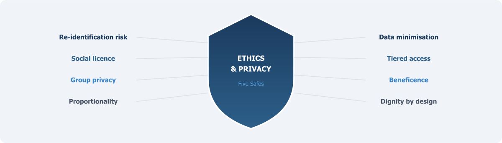

::: {.chapter-illustration}

:::

Chapter 8 argued that organisational design must be built on trust — the trust of data holders, of researchers, and above all, of the citizens whose information the infrastructure uses. This chapter examines the ethical and privacy foundations on which that trust depends.

A National Data Infrastructure built on the integration of administrative records is, at its core, a project that depends on the willingness of citizens to trust that their information will be handled responsibly. This is not a secondary concern to be addressed once the technical architecture is in place. It is the foundation on which the entire enterprise stands or falls.

The United Kingdom's experience with care.data offers a stark illustration. In 2014, NHS England launched a programme to extract patient records from general practitioner systems and link them to hospital data for research and planning. The programme was abandoned in 2016 after sustained public and professional opposition, driven by inadequate communication, unclear consent mechanisms, and revelations that patient data had been shared with insurance companies and commercial organisations without proper governance (Carter et al., 2015; Sterckx et al., 2016). The technical infrastructure was sound. The ethical infrastructure was not. As Floridi and Taddeo (2016) observed, the care.data experience demonstrated that social acceptability must be the guiding principle for any data science project with even a remote impact on human life.

For Pakistan, the stakes may be even higher. The country does not yet have a comprehensive data protection law. The Personal Data Protection Bill, first drafted in 2023, has not been enacted as of mid-2025. NADRA holds biometric records on over 200 million citizens — one of the world's largest centralised identity databases — yet a Joint Investigation Team confirmed in 2024 that data on 2.7 million citizens was stolen from NADRA systems between 2019 and 2023, with records transferred to Dubai and eventually sold in Argentina and Romania (Privacy International, 2024). FBR suffered a separate data breach in 2021. These are the very agencies whose administrative data any new statistical infrastructure would seek to integrate. Without a credible ethical framework, the public will have every reason to resist.

## The Re-identification Problem Is Real

The starting point for any ethical discussion of data linkage is the recognition that "de-identified" data is not the same as anonymous data. In 2000, Latanya Sweeney demonstrated that 87 per cent of the United States population could be uniquely identified using just three pieces of information: a five-digit zip code, date of birth, and gender (Sweeney, 2000). This finding — replicated and extended in numerous subsequent studies — established a fundamental principle: removing names and identity numbers from a dataset does not, by itself, protect individuals from re-identification. When multiple datasets are combined, the risk increases, because each additional source provides new quasi-identifiers that can be cross-referenced to narrow down individuals.

In the context of a Pakistani data infrastructure that might link NADRA identity records with tax data from FBR, health facility records from DHIS2, education data from NEMIS, and social protection records from BISP, the re-identification risk is not theoretical. The CNIC number provides a direct linkage key. Even without CNIC, combinations of district, age, gender, household size, and programme participation status could identify individuals in sparsely populated areas or among minority groups with distinctive demographic profiles.

The infrastructure must be designed on the assumption that re-identification is always technically possible, and that the protection of individuals therefore depends not only on statistical disclosure control but on the institutional safeguards, legal constraints, and governance mechanisms that control who can access what data, for what purpose, under what conditions. This is precisely the logic underlying the **Five Safes framework** that runs through this book — it explicitly rejects the idea that de-identification alone is adequate, treating privacy protection as a system property produced by multiple layered safeguards rather than a feature of any individual technical step.

## Why Consent Alone Cannot Solve the Problem

Traditional research ethics, rooted in the Belmont Report's principles of respect for persons, beneficence, and justice, place informed consent at the centre of ethical practice. These principles remain essential. But they face severe practical limitations when applied to the integration of administrative records.

The data in administrative systems was collected for operational purposes — registering births, collecting taxes, distributing social protection payments, recording hospital visits — not for statistical research. Citizens provided their information to receive a service, not to participate in a study. Seeking retrospective consent from millions of individuals whose records are already in government databases is logistically impossible. More importantly, it would introduce devastating selection bias: those who decline consent would disproportionately be the most vulnerable, the most distrustful of government, and the most difficult to reach. The resulting datasets would systematically misrepresent the very populations that statistical evidence is most needed to serve. Studies of consent bias in data linkage consistently find that non-consenters differ systematically from consenters on key sociodemographic variables, including income, education, and health status (Sakshaug et al., 2012).

The alternative to individual consent is not the absence of consent. It is a different model of authorisation — one based on legal frameworks, institutional governance, and what scholars have termed **social licence**. Borrowed from the extractive industries and adapted for data use, social licence refers to the ongoing acceptance by the public that their data is being used in ways that are legitimate, transparent, and beneficial (Carter et al., 2015). Social licence is not granted once and forgotten. It must be continuously maintained through transparent communication about what data is being used, by whom, for what purposes, with what safeguards, and to what public benefit. When social licence is violated — as it was with care.data — the damage to public trust can take years to repair.

For Pakistan, this means that the ethical framework cannot rely solely on the legal authority granted to PBS under the 2011 Act. Legal authority is necessary but not sufficient — a point made repeatedly in Chapters 5 and 6. The infrastructure must also demonstrate, through visible and accountable governance mechanisms, that data about citizens is being used for their benefit and not to their detriment. This is especially important in a context where citizens have seen their data compromised through security breaches at the very agencies whose records will form the backbone of the infrastructure.

## The Problem of Group Privacy

Conventional data protection frameworks focus on protecting the identity of individual persons. The GDPR, for instance, is concerned primarily with identifiable natural persons. But as Floridi (2014) argued, this individualistic focus misses an important dimension. In data-intensive environments, harms can occur at the group level even when no individual is identified. If a linked dataset reveals that residents of a particular neighbourhood have high rates of certain health conditions, or that members of a particular ethnic or religious community are disproportionately represented in social protection programmes, the information can be used to stigmatise, discriminate against, or target those communities — without any single individual being named.

This concern has particular salience in Pakistan. The country's social fabric is characterised by deep ethnic, sectarian, and linguistic divisions. Administrative data, when linked across sources, could reveal patterns that, in the wrong hands or without proper governance, might reinforce existing inequalities or facilitate surveillance and discrimination. Data on caste, tribe, ethnicity, and religious affiliation — all collected in various administrative systems — is classified as "sensitive personal data" even under Pakistan's draft data protection bill. The ethical framework must address group privacy explicitly, not merely as an extension of individual privacy but as a distinct concern requiring its own safeguards. This might include restrictions on certain types of analysis, requirements for community consultation before research involving identifiable population subgroups, and prohibitions on outputs that could facilitate discrimination.

Taylor (2017), writing about the ethics of data use in developing countries, has noted that data collected ostensibly for humanitarian or development purposes can be repurposed for surveillance, border control, or political targeting. In contexts where the state's relationship with certain communities is characterised by tension or conflict — and this includes parts of Pakistan — the risk that linked administrative data could be used for purposes far removed from statistical analysis is not negligible. The ethical framework must include mechanisms to prevent such repurposing, including legal restrictions on secondary use, independent oversight of data access decisions, and transparency requirements that enable civil society to monitor how the data is being used.

## Proportionality and the Minimum Necessary Principle

The ethical use of administrative data requires adherence to the principle of **proportionality**: the benefits of data use must be proportionate to the risks, and the data accessed should be the minimum necessary to achieve the stated purpose. This principle — embedded in the GDPR and most data protection frameworks globally — has practical implications for how Pakistan's infrastructure should operate.

First, not all data needs to be linked at the individual level. Many important statistical questions can be answered using aggregate data, tabulations, or statistical techniques that do not require access to individual records. The infrastructure should be designed so that individual-level linkage is reserved for research questions that genuinely require it, and even then, the linked data should be de-identified to the maximum extent consistent with analytical validity. The principle of **data minimisation** — already discussed in Chapter 5 as an operating principle — should be built into the technical architecture, not merely stated as a policy aspiration.

Second, access to linked data should be tiered. Some users may need only aggregate statistics or pre-computed indicators. Others may require access to microdata within a secure research environment. The most sensitive linkage projects — those involving health records, criminal justice data, or information about vulnerable populations — should require additional layers of approval, including review by an independent ethics committee with representation from affected communities. The Australian model, in which the Australian Institute of Health and Welfare (AIHW) operates its own ethics committee and conducts independent review of all data linkage proposals involving health and welfare data, provides one template (AIHW, 2022).

Third, the outputs of any research using linked data must be subject to disclosure control before release. All tables, figures, and statistical results should be reviewed to ensure that small cell counts, unusual variable combinations, or other features do not permit the identification of individuals or small groups. The UK's ONS operates a systematic output checking process for all research conducted in its Secure Research Service, and a similar process should be a non-negotiable component of any Pakistani data research environment.

## The Question of Benefit

An ethical framework that focuses only on preventing harm, while necessary, is incomplete. The use of citizens' data must also demonstrate positive benefit — and specifically, benefit that flows back to the communities whose information the infrastructure holds. This is the principle of beneficence.

In the context of a statistical data infrastructure, beneficence means that the research conducted using linked data should address questions that matter for public welfare. If administrative data from BISP is linked with education records to study the impact of cash transfers on children's school attendance, the findings should inform policy in ways that benefit the programme's beneficiaries — the poorest households in the country. If health facility data from DHIS2 is linked with vital registration to study maternal mortality, the results should contribute to interventions that reduce maternal deaths.

The governance framework should include mechanisms for prioritising research that serves the public interest. Not every proposed use of linked data will be equally valuable. The UK's Digital Economy Act 2017 explicitly requires that data shared under its provisions be used for purposes that serve the "public good." Pakistan's legal framework should include a similar requirement, and the governance body overseeing data access should have authority to reject proposals that do not meet this standard.

Equally important is the communication of benefits. The public must be able to see, in concrete terms, what societal good has come from the use of their data. This requires proactive transparency: regular public reporting on what research has been conducted, what findings have emerged, and what policy changes have resulted. If citizens can see that their data contributed to evidence that improved maternal health services, or identified gaps in educational access, or strengthened the targeting of social protection programmes, they are more likely to maintain their support for the infrastructure. If the benefits remain invisible, the social licence on which the infrastructure depends will erode.

## Pakistan's Ethical Landscape

Pakistan's constitutional and legal framework provides some foundation for data ethics, but significant gaps remain. Article 14(1) of the Constitution guarantees the dignity of man and, subject to law, the privacy of home. The courts have interpreted this expansively; the Lahore High Court in M.D. Tahir v. State Bank of Pakistan held that unauthorised collection of personal data constituted an extraordinary invasion of liberty. But constitutional provisions are general principles, not operational frameworks. Without implementing legislation — with enforcement mechanisms and meaningful sanctions — the constitutional right to privacy remains more aspirational than protective.

The absence of a comprehensive data protection law is perhaps the most significant ethical gap. The Personal Data Protection Bill 2023 has not been enacted. The draft has been criticised by digital rights organisations for exempting government agencies from key compliance obligations — precisely the agencies whose data would be integrated (GenderIT, 2025). If the government exempts its own data handling from the rules it imposes on the private sector, the credibility of any ethical framework will be fundamentally compromised.

NADRA's track record illustrates the problem concretely. Despite holding biometric records on virtually the entire adult population, NADRA has experienced multiple security breaches, and the 2024 Joint Investigation Team report revealed that data theft was facilitated by insiders at NADRA offices in multiple cities (Privacy International, 2024). For citizens, these experiences shape their perception of government data handling. An ethical framework for the new infrastructure must acknowledge this history honestly and take concrete steps to demonstrate that the new system will operate under fundamentally different standards.

Several practical measures could help establish ethical credibility. First, data-sharing legislation should apply equally to government and non-government entities, with no blanket exemptions. Second, an independent oversight body — distinct from both PBS and the data-holding agencies — should review and approve all data linkage projects, with authority to reject proposals and to audit compliance. Third, a public register of all approved data linkage projects should be maintained and accessible to citizens. Fourth, the infrastructure should adopt the Five Safes framework or a comparable principles-based approach as its communicable standard for ethical data use. Fifth, meaningful sanctions for data misuse — including criminal penalties for deliberate breaches and administrative penalties for negligent handling — should be established by law and enforced consistently.

## Dignity as a Design Principle

The ethical considerations discussed in this chapter are sometimes presented as constraints on the infrastructure — as obstacles that slow down the work and limit what can be done with data. This framing is mistaken.

> Ethics is not an obstacle to building a data infrastructure. It is a design requirement for building one that works.

An infrastructure that respects the dignity of data subjects — that treats citizens not as sources of extractable information but as rights-holders whose data carries obligations — will earn the trust it needs to function. An infrastructure that ignores these considerations may be built, but it will operate in a climate of suspicion, non-cooperation, and resistance that will ultimately limit its usefulness far more than any ethical safeguard ever could. The care.data experience is only the most prominent example. Around the world, data-intensive programmes that failed to invest in ethical governance have faced public backlash, legal challenges, and political abandonment.

Pakistan has the opportunity to learn from these experiences and to build ethics into the infrastructure from the beginning, rather than attempting to retrofit it after trust has been lost. The challenge is significant, given the legal gaps, institutional vulnerabilities, and the history of data breaches. But it is precisely because the context is difficult that the ethical commitment must be explicit, visible, and credible.

With principles established (Chapter 5), the institutional home identified (Chapter 6), quality frameworks defined (Chapter 7), organisational options assessed (Chapter 8), and the ethical foundation now set out, the infrastructure's foundations are complete. But infrastructure designed only for today's analytical methods will become obsolete. Chapter 10 turns to the challenge of making Pakistan's data **AI-ready** — preparing the infrastructure for the computational methods that will increasingly define the future of official statistics.

## References

AIHW (2022). *Data Governance Framework*. Canberra: Australian Institute of Health and Welfare.

Carter, P., Laurie, G. T. and Dixon-Woods, M. (2015). The social licence for research: why care.data ran into trouble. *Journal of Medical Ethics* 41(5), 404–409.

Floridi, L. (2014). Open data, data protection, and group privacy. *Philosophy and Technology* 27(1), 1–3.

Floridi, L. and Taddeo, M. (2016). What is data ethics? *Philosophical Transactions of the Royal Society A* 374(2083), 20160360.

GenderIT (2025). Between privacy and power: the fine line in Pakistan's data protection bill. GenderIT.org.

Privacy International (2024). State of Privacy: Pakistan. London: Privacy International.

Ritchie, F. (2017). The 'Five Safes': a framework for planning, designing and evaluating data access solutions. *Data for Policy Conference 2017*.

Sakshaug, J. W., Couper, M. P., Ofstedal, M. B. and Weir, D. R. (2012). Linking survey and administrative records: mechanisms of consent. *Sociological Methods and Research* 41(4), 535–569.

Sterckx, S., Rakic, V., Cockbain, J. and Borry, P. (2016). "You hoped we would sleep walk into accepting the collection of our data": controversies surrounding the UK care.data scheme and their wider relevance for biomedical research. *Medicine, Health Care and Philosophy* 19(2), 177–190.

Sweeney, L. (2000). Simple demographics often identify people uniquely. *Carnegie Mellon University Data Privacy Working Paper* 3.

Taylor, L. (2017). The ethics of big data as a public good: which public? whose good? *Philosophical Transactions of the Royal Society A* 374(2083), 20160126.

UK Digital Economy Act (2017). *Digital Economy Act 2017*. London: Her Majesty's Stationery Office.
