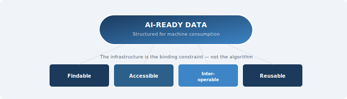

::: {.chapter-illustration}

:::

Chapter 9 established the ethical foundations on which a **National Data Infrastructure** must rest. Those foundations — protecting citizens, earning trust, ensuring benefit — are essential not only for today's statistical methods but for the far more powerful analytical tools now emerging. This chapter argues that the infrastructure Pakistan builds must be designed not merely for traditional statistical tabulation but for a future in which artificial intelligence and advanced analytics are standard tools of evidence production.

It would be a significant mistake to design a data infrastructure that serves only today's demands. Artificial intelligence and machine learning are not futuristic possibilities. They are present realities — transforming everything from how national accounts are compiled to how satellite imagery is classified, from how survey non-response is imputed to how administrative records are linked across agencies. Generative AI, agentic AI, and machine learning are all reshaping how data is produced, managed, and used. None of these applications would be possible without high-quality, well-structured, properly documented data.

This does not mean Pakistan should rush blindly to adopt every emerging technology. It means something more fundamental: that the basic properties of data — its structure, its documentation, its consistency, its accessibility — must meet standards that enable not only human analysts but also machines to find, read, interpret, and use it. Getting these foundations right is the most important investment the country can make. Without them, even the most sophisticated algorithms will produce unreliable results, and the promise of AI for public policy will remain unfulfilled.

## The Gap Between Collecting Data and Making It Usable

Pakistan collects an enormous amount of data. This has been a recurring theme throughout this book — from Chapter 1's observation that the country is not short of data but short of infrastructure, through Chapter 4's mapping of the data landscape. NADRA processes biometric records for over 200 million citizens. DHIS2 captures data from thousands of health facilities. NEMIS tracks school enrolments and teacher deployments. FBR holds tax records. BISP maintains records on millions of beneficiary households. PBS conducts censuses, labour force surveys, household income and expenditure surveys, and many other exercises.

But collecting data is not the same as making it usable. Much of Pakistan's existing data exists in formats that are difficult to access, hard to combine, and poorly documented. Survey microdata files are sometimes released without complete data dictionaries or codebooks. Administrative records follow agency-specific coding systems that are incompatible with one another. Metadata — the descriptive information that tells a user what each variable means, how it was measured, when it was collected, and what limitations it carries — is frequently incomplete or altogether absent. Chapter 7 identified this metadata deficit as perhaps the most urgent quality challenge facing Pakistan's statistical system. A dataset without proper metadata is like a library book without a catalogue entry: it may contain valuable information, but no one can find it or determine how to interpret it correctly.

This problem is not unique to Pakistan. Across the world, researchers report spending up to 80 per cent of their time preparing data into usable formats before any analysis can begin (Bipartisan Policy Center, 2022). In developing countries, where technical capacity is already scarce, this inefficiency is especially costly. The infrastructure Pakistan builds must treat data preparation, documentation, and quality assurance not as afterthoughts but as core functions — as essential as data collection itself.

## What FAIR Actually Requires

Chapter 7 introduced the FAIR principles — Findable, Accessible, Interoperable, and Reusable — as a complementary framework for assessing whether data is managed in ways that support its use. Here, we examine what FAIR requires in operational terms, particularly as the demands shift from human researchers to computational systems.

**Findable** means that datasets must be registered in searchable catalogues with rich, standardised metadata, and each must have a unique persistent identifier. In Pakistan today, there is no comprehensive catalogue of government data holdings. A researcher wanting to know what education data is available, at what geographic level, for what time periods, would need to contact individual agencies and hope for a response. The national data catalogue recommended in Chapter 6 — as part of the inventory function — would be a relatively low-cost, high-impact first step toward making data findable.

**Accessible** means there is a clear, documented process for obtaining access. This does not require that all data be openly downloadable — individual-level administrative records must be restricted for the privacy reasons discussed in Chapter 9. But access procedures must be transparent and standardised, not ad hoc. The current situation in Pakistan, where access to government data often depends on personal connections and informal negotiations, is neither efficient nor equitable.

**Interoperable** means that data from different sources must be able to work together. This requires common coding standards, shared classification systems, and compatible file formats. If DHIS2 records a patient's district using one coding scheme and NADRA uses a different one, linking the two becomes a labour-intensive exercise in manual reconciliation. Interoperability is not achieved by decree — it requires sustained technical work to develop and maintain common standards. The Statistical Data and Metadata Exchange (SDMX) framework provides one starting point. Pakistan's adoption of SDMX standards would be a significant step.

**Reusable** means that data must be well-documented enough that it can be understood and used in new contexts by people who were not involved in its original collection. This requires detailed metadata and clear licensing that specifies what users are permitted to do with the data. In Pakistan, the legal status of government data — who owns it, who can use it, under what conditions — is often ambiguous. This ambiguity discourages reuse.

It is worth emphasising that FAIR does not mean "open." A dataset can be FAIR — well-documented, discoverable, structured, and accessible through a transparent process — without being publicly downloadable. For administrative data containing sensitive individual-level information, the FAIR framework accommodates restricted access. What it requires is that conditions of access are clear and standardised, not that access is unrestricted.

## Why AI Changes the Stakes

The FAIR principles were developed primarily with human researchers in mind, but they have become even more important in the age of artificial intelligence. Machine learning systems are powerful pattern-recognition tools and also major consumers of data. A human analyst can often work around inconsistencies — recognising that "Faisalabad" and "Lyallpur" refer to the same city, or that a column labelled "inc" probably means "income." A machine cannot make these inferences unless the data is structured and documented in ways that eliminate ambiguity.

**AI-ready** data is not only high-quality by traditional statistical standards but also structured for machine consumption. The UK government's 2025 guidelines on making government datasets AI-ready identify four pillars: technical optimisation (data is structured and formatted for efficient machine use); data and metadata quality (data is accurate, complete, consistent, and maintained through effective processes); organisational and infrastructure context (data governance and stewardship arrangements are in place); and legal, security, and ethical compliance (data use is aligned with applicable laws and managed responsibly) (DSIT, 2025). These four pillars are not separate from good statistical practice. They are the same principles that make data useful for any purpose, carried to the standard of consistency and documentation that machines require.

For Pakistan, the practical implications are significant. Consider the potential use of machine learning to improve the targeting of social protection programmes. BISP currently uses a proxy means test based on household survey data to determine eligibility. Machine learning methods could improve targeting accuracy by combining survey data with tax data, utility consumption, land ownership records, and school enrolment to build more nuanced predictions of household welfare. But this would require all sources to be structured in compatible formats, documented with consistent metadata, linked through common identifiers, and accessible through governed procedures. Without these foundations — the very foundations this book has been describing — the machine learning application is not feasible, regardless of how sophisticated the algorithm.

The same logic applies across domains: predictive analytics for disease surveillance using DHIS2 data, satellite imagery classification for agricultural crop monitoring, natural language processing of court records, text mining of parliamentary proceedings. In every case, the quality, structure, and documentation of the underlying data determine whether the method can produce reliable results. **The data infrastructure is the binding constraint, not the algorithm.**

## The National Data Library as Institutional Architecture

The concept of a National Data Library has gained significant momentum internationally, most prominently in the United Kingdom, where the government announced plans in 2024 to create such an institution. The UK's National Data Library is not a single centralised database. It is a service layer — a governed infrastructure that enables curated, de-identified, research-ready datasets to be discoverable, accessible, and linkable within secure environments (GOV.UK, 2025). The Tony Blair Institute estimated in 2025 that a fully developed National Data Library could generate returns of £5 for every £1 invested in data linkage (TBI, 2025).

The UK model builds on the work of ADR UK, which since 2018 has invested over £105 million in creating secure access to linked administrative data. A key insight from ADR UK's experience is that the traditional "create and destroy" model of data access — where each research project negotiates its own access, conducts its own linkage, and destroys the linked dataset after use — is enormously inefficient. The ADR UK approach instead does the governance, cleaning, and linkage work upfront, so that curated, research-ready datasets can be maintained over time and accessed by multiple approved researchers. This allows knowledge to accumulate: researchers can share code, derived variables, and analytical methods, building on what has come before (ADR UK, 2024).

For Pakistan, the National Data Library concept is worth adapting to local conditions. The country does not need a replica of the UK system. It needs a mechanism that performs several essential functions: cataloguing what data exists across government; establishing and enforcing common standards; creating governed access procedures; providing a secure environment for approved research; and building institutional capacity for data curation and stewardship. This last function — capacity for data curation — is perhaps the most neglected and most important. Data does not curate itself. Converting raw administrative records into research-ready datasets requires skilled professionals who understand both the domain and the technical requirements. A National Data Library is not primarily a technology project. It is an institutional project.

## From Static Systems to Adaptive Infrastructure

Several developments illustrate what an adaptive infrastructure must prepare for.

First, the growing availability of **geospatial data** — satellite imagery, GPS traces, mobile phone location data — offers enormous potential for understanding economic activity, agricultural production, urbanisation, and environmental change. Pakistan's agricultural sector, increasingly affected by climate variability, could benefit from integrating satellite-derived crop estimates with ground-level survey data. But this requires the infrastructure to handle raster data, vector data, and tabular data within a common framework.

Second, the proliferation of **real-time and high-frequency data streams** — from mobile phones, digital payments, web traffic, sensor networks — creates opportunities for more timely indicators. During the COVID-19 pandemic, countries that could rapidly deploy alternative data sources were better positioned to monitor the crisis. Pakistan's infrastructure should be designed to incorporate such sources as they become available.

Third, the development of **privacy-preserving analytical techniques** — differential privacy, federated learning, secure multi-party computation — offers new ways to extract insights from sensitive data without exposing individual records. Federated learning, for example, allows machine learning models to be trained on data distributed across multiple institutions without the data ever leaving its original location. This could be particularly valuable in Pakistan, where institutional reluctance to share raw data is a major barrier. If the infrastructure supports federated approaches, agencies can contribute to analytical products without surrendering control.

Fourth, the emergence of **large language models and generative AI tools** creates new possibilities for working with unstructured data — text, images, audio — that has traditionally been outside the scope of statistical infrastructure. Court records, parliamentary debates, citizen complaints, and media coverage all contain information relevant to policy analysis.

None of these developments require Pakistan to adopt them immediately. They require that the infrastructure be designed with sufficient flexibility to accommodate them as they mature and as the country's technical capacity grows. This means adopting open standards rather than proprietary formats, modular architectures rather than monolithic systems, and governance frameworks that can evolve — the principle of continuous improvement established in Chapter 5.

The temptation in any large infrastructure project is to build for the specifications of the moment. The infrastructure should instead be built on the principle that change is not an exception to be managed but a constant to be expected. APIs should accommodate new data sources without requiring re-architecture. Storage systems should handle structured, semi-structured, and unstructured data. Governance protocols should be flexible enough to apply to data types not yet imagined. This is not a call for unlimited spending on future-proofing. It is a call for architectural decisions that prioritise openness and modularity over closure and rigidity.

## The Political Economy of Data as a Public Asset

There is one final argument that must be made, and it is not a technical one. Data produced through the use of public resources — through government surveys, administrative processes, and publicly funded research — is a public asset. It belongs to the citizens whose taxes funded its collection and whose information it contains. Treating it as such has implications for how the infrastructure is governed.

In too many countries, including Pakistan, government data is treated as the property of the agency that collected it. This reluctance to share was identified in Chapter 4 as the incentive problem and addressed in Chapter 6 as the reciprocity challenge. The reluctance is sometimes justified by legitimate concerns about privacy, quality, or misinterpretation. But it is often driven by institutional culture — a sense of ownership over "my data" — or by bureaucratic inertia. The result is that data collected at public expense sits unused in agency silos, generating no value beyond the narrow purpose for which it was originally collected.

The World Bank's Development Data Group has articulated this vision in terms of "AI-ready development data," arguing that the challenge is not a scarcity of high-quality data but rather the absence of standardised frameworks and infrastructure to make existing data consistently findable, accessible, and usable (World Bank, 2025). The same argument applies to Pakistan. The data exists. The gap is in the infrastructure — technical, institutional, and legal — that would make it useful.

> The decisions made in the next few years about how Pakistan's data infrastructure is designed will shape the country's analytical capacity for decades.

If the infrastructure is built on open standards, with strong governance, comprehensive metadata, and the flexibility to accommodate new data sources and methods, it will serve as a foundation for continuous improvement. If it is built as a rigid, closed, and poorly documented system, it will become another legacy burden. The choice is not between a perfect system and no system. It is between a system designed to learn and grow, and one that is not. Pakistan should choose the former.

The preceding chapters — from Chapter 1's diagnosis of the problem through Chapter 10's vision of AI-readiness — have set out the full argument. Chapter 11 brings it together: what should be done first, what can be done now, and how to sequence the transformation so that each step creates the conditions for the next.

## References

ADR UK (2024). The new UK Government wants a National Data Library: a brilliant aspiration, if built on solid foundations. London: Administrative Data Research UK.

Bipartisan Policy Center (2022). AI-Ready Open Data. Washington, DC: Bipartisan Policy Center.

DSIT (2025). Guidelines and best practices for making government datasets ready for AI. London: Department for Science, Innovation and Technology.

GOV.UK (2025). National Data Library. London: HM Government.

TBI (2025). Governing in the Age of AI: Building Britain's National Data Library. London: Tony Blair Institute for Global Change.

UK Digital Economy Act (2017). *Digital Economy Act 2017*. London: Her Majesty's Stationery Office.

Wilkinson, M. D., Dumontier, M., Aalbersberg, I. J., Appleton, G., Axton, M., Baak, A., Blomberg, N., Boiten, J.-W., da Silva Santos, L. B., Bourne, P. E. and others (2016). The FAIR Guiding Principles for scientific data management and stewardship. *Scientific Data* 3, 160018.

World Bank (2025). From Open Data to AI-Ready Data: Building the Foundations for Responsible AI in Development. Washington, DC: World Bank Development Data Group.
