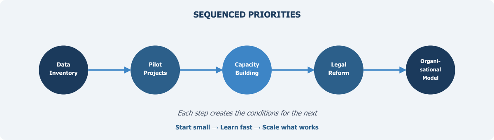

::: {.chapter-illustration}

:::

The preceding chapters have set out a case for fundamental change in how Pakistan produces, manages, and uses data for public policy. The argument, in brief, is this: the country's current statistical system — built around periodic large-scale surveys conducted by a single bureau — is no longer adequate for the demands placed upon it. A **National Data Infrastructure** must blend survey data with administrative records and other sources, must be governed by institutions with the authority and capacity to coordinate across agencies, must meet rigorous standards of quality and ethical practice, and must be designed for a future in which artificial intelligence and advanced analytics are standard tools. **Pakistan does not lack data — it lacks a system.** None of this is controversial in principle. The challenge is in execution.

Vision documents are easy to write and, in Pakistan as in many countries, rarely in short supply. What is in short supply is the disciplined sequencing of concrete actions that can move a system from where it is to where it needs to be. The temptation is always to attempt everything simultaneously — to draft comprehensive legislation, build sophisticated technology platforms, recruit hundreds of specialists, and launch dozens of pilot projects all at once. This approach almost invariably fails. Resources are spread too thin, institutional resistance overwhelms fragmented reform efforts, and early failures discredit the entire enterprise before it has a chance to demonstrate value. The alternative is to sequence reforms carefully, beginning with actions that are achievable in the short term and that create the conditions for more ambitious changes later.

## Mapping What Exists Before Building What Is Needed

The first priority is deceptively simple: establishing a comprehensive inventory of what data the government already holds. Chapter 6 argued that this inventory function is one of the most basic but most neglected responsibilities of a **national data coordinator**. Pakistan's federal and provincial agencies collectively maintain vast quantities of administrative data — NADRA's biometric records, FBR's tax files, BISP's beneficiary databases, DHIS2's health facility records, NEMIS's education data, the Punjab Land Record Authority's digitised cadastral records, and many others. But there is currently no systematic catalogue that tells researchers, policymakers, or even other government agencies what data exists, at what resolution, in what format, and under what conditions it might be accessed.

A national data inventory — a structured register of government data assets with standardised descriptions of content, coverage, quality, and access procedures — is the essential first step. Without it, every subsequent action is built on guesswork. The inventory need not be perfect or complete from the outset. It should begin with the major federal agencies and expand progressively to include provincial governments and other data holders. The exercise itself will reveal gaps, inconsistencies, and opportunities that are currently invisible. It will also begin the process of normalising the idea that government data is a shared national asset rather than the property of the agency that collected it.

This inventory should be led by a cross-agency data working group, convened under the authority of the Chief Statistician and including senior representatives from the principal data-holding agencies. The working group's mandate should extend beyond the inventory to encompass the development of common data standards, metadata requirements, and governance protocols — the interoperability standards that Chapters 2, 7, and 10 have each identified as essential. Its establishment signals institutional commitment to coordination and provides a forum for resolving the inter-agency tensions that have historically impeded data sharing.

## Demonstrating Value Through Pilot Projects

Reform efforts that begin with years of planning before producing any tangible output lose momentum and political support. Pakistan's data infrastructure transformation should instead follow the principle of "start small, learn fast, scale what works." This means identifying two or three pilot projects where **blending** survey data with administrative records can produce immediate, visible improvements in the quality or timeliness of statistical outputs.

The candidates are not difficult to identify. Consider poverty measurement: BISP's household registry contains detailed information on millions of families. Linking this data with FBR tax records, utility consumption data, and school enrolment records from NEMIS could produce more timely and granular estimates of household welfare than the periodic HIES alone can provide. The technical challenges — establishing common identifiers, reconciling different coding schemes, managing privacy risks through the Five Safes framework discussed in Chapters 5 and 9 — are real but not insurmountable. And the policy payoff is significant: better-targeted social protection programmes that reach the people who need them most.

A second pilot might focus on health. The DHIS2 system already captures facility-level data across the country. Linking this with civil registration records (where available) and NADRA's population database could improve the accuracy of health indicators that currently rely on sample surveys with substantial sampling error at the district level. A third pilot might address education, linking NEMIS school data with examination board records and labour force survey data to trace educational pathways and employment outcomes.

The purpose of these pilots is not merely to produce better statistics, though they should do that. It is to demonstrate that **blended data** approaches work in practice, to build the technical skills required for data linkage within PBS and partner agencies, and to create a track record that justifies the larger investments needed for system-wide transformation. Each pilot should be designed with explicit evaluation criteria, so that its successes and failures can inform subsequent decisions about scaling and institutional design.

## Investing in People Before Investing in Technology

No data infrastructure can function without skilled people to operate it. This is perhaps the most important lesson from the international experience reviewed throughout this book. The countries that have built successful data linkage systems — the United Kingdom, the Netherlands, Australia, the Nordic states — have invested heavily and consistently in human capacity. Pakistan must do the same.

The current skills base within PBS and provincial statistical agencies is heavily oriented toward survey design, fieldwork management, and tabulation — the competencies required by the traditional model. The new infrastructure requires additional competencies: record linkage techniques, statistical disclosure control, data quality assessment for administrative sources, machine learning methods, and the governance skills needed to manage complex multi-agency data sharing arrangements. These skills do not develop overnight, and they cannot be acquired solely through short training workshops.

A serious capacity-building programme should include several elements. First, partnerships with universities — both domestic and international — to develop specialised curricula in data science for official statistics. Second, placement programmes that embed PBS staff in international statistical agencies with established data linkage operations, allowing them to learn through hands-on experience. Third, the recruitment of new staff with backgrounds in computer science, data engineering, and related fields, which will require reforming civil service recruitment processes that currently make it difficult for statistical agencies to compete for technical talent. Fourth, investment in training for staff at data-holding agencies beyond PBS, since effective data sharing requires that the agencies producing administrative data understand the standards and procedures that make their data usable for statistical purposes.

## Establishing the Legal and Institutional Framework

The pilot projects and capacity-building efforts described above can begin under existing institutional arrangements. But sustaining and scaling them will require legal and regulatory reform. As Chapters 5, 6, and 8 have argued, Pakistan currently lacks both a comprehensive data protection law and a clear legal framework for sharing administrative data for statistical and research purposes. The 2011 Act gives PBS certain authorities, but these were designed for a world in which the bureau collected its own data through surveys, not one in which it coordinates data flows across dozens of agencies.

The legal reform agenda should address several specific needs. First, a data protection law that establishes clear rules for how personal data may be collected, stored, shared, and used, with meaningful enforcement mechanisms and an independent oversight body — but one that does not exempt government agencies from its core obligations, as Chapter 9 emphasised. Second, amendments to statistical legislation that give PBS explicit authority to access administrative data for approved statistical purposes, subject to appropriate safeguards — the **statistical purpose doctrine** outlined in Chapter 5. Third, legal provisions establishing that government data shared for research must be used for the public good.

These legislative changes should be informed by the experience of the pilot projects. One of the advantages of starting with practical demonstrations is that they reveal the specific legal barriers that need to be addressed, allowing legislation to be drafted with precision rather than in the abstract. They also build the political constituency for reform: agencies that have seen the benefits of data sharing in practice are more likely to support the legal framework that enables it.

## Choosing the Right Organisational Model

Chapter 8 reviewed a range of organisational models — from the Netherlands' centralised CBS to Estonia's distributed X-Road to intermediate models like Australia's AIHW and the UK's ADR UK partnership. The right model for Pakistan will depend on factors that can only be fully assessed after the initial phase of mapping, piloting, and capacity-building. It would be premature to commit to a specific structure before understanding the practical realities of inter-agency coordination, the political dynamics of federal-provincial relations as they affect data sharing, and the absorptive capacity of the institutions involved.

What can be said with confidence is that the model must satisfy the requirements identified throughout this book: sufficient authority to coordinate data sharing; operational independence to maintain public trust; accommodation of Pakistan's federal structure; and sustainability that does not depend on the enthusiasm of individual champions or the priorities of a single political cycle.

The medium-term goal should be to select and begin implementing an organisational model within three to five years of the initial reforms, drawing on evidence from the pilot projects and institutional learning from the data working group. This is not a delay. It is a recognition that institutional design decisions made without adequate evidence tend to produce institutions that look impressive on paper but fail in practice.

## The Sequencing Principle

The priorities outlined above are not a checklist to be completed in parallel. They are a sequence, in which each step creates the conditions for the next:

- The **data inventory** reveals what is available and what is missing.
- The **pilot projects** demonstrate what is possible and build technical capacity.
- The **capacity-building programme** ensures institutions have the people needed to sustain and expand the work.
- The **legal reforms** remove the barriers that limit scaling.
- The **organisational model** provides the institutional home for the mature system.

This sequencing is itself a form of risk management. By starting with low-cost, reversible actions — mapping data, running pilots, training staff — Pakistan can learn what works before committing to expensive and difficult-to-reverse institutional changes. If a pilot reveals that a particular data source is unusable, or that a particular agency is unwilling to cooperate, these lessons can be incorporated into subsequent phases without having wasted large investments on assumptions that proved wrong.

The country has spent decades discussing statistical reform. It has produced numerous reports, strategies, and action plans, many of which contain sensible recommendations that were never implemented. The difference this time must be in execution: in the willingness to begin with concrete, modest, achievable steps rather than waiting for a comprehensive plan that satisfies everyone, and in the discipline to learn from each step and adjust course accordingly.

> The data infrastructure Pakistan needs will not be built in a single leap. It will be built incrementally, through sustained effort, institutional learning, and the gradual accumulation of capability, trust, and demonstrated value.

## Why This Matters

It is worth stepping back, in closing, to recall why any of this matters. Statistics are not an end in themselves. They are the means by which a society understands its own condition — how many children are in school and whether they are learning, how many people are in work and whether their wages are rising, how disease burden is distributed and whether health services are reaching those who need them, how public money is being spent and whether it is achieving its intended purposes. A society that cannot answer these questions reliably is a society governing in the dark.

Pakistan faces enormous challenges: a young and rapidly growing population that needs education and employment, a health system under strain, an economy that must become more productive and more equitable, a climate that is becoming more hostile to agriculture and human settlement. Addressing these challenges requires not only political will and financial resources but also evidence — evidence about what is happening, where, to whom, and why. The **National Data Infrastructure** described in this book is the foundation on which that evidence must be built.

This is not just a technical challenge, though the technical demands are real. It is a governance challenge, because data must flow across institutional boundaries that have historically been impermeable. It is a legal challenge, because the frameworks governing data collection, sharing, and protection must be modernised. It is an ethical challenge, because the rights of data subjects must be protected even as their information is put to new uses. And it is, ultimately, a political challenge, because it requires commitment from the highest levels of government and a willingness to change how things have been done for decades.

But the potential rewards are proportionate to the difficulty. A functioning data infrastructure — one in which trusted, well-governed, interoperable data can be combined across sources to produce timely and accurate evidence — would transform not only the statistical system but the quality of governance itself. It would enable social protection programmes that actually reach the poorest households, health interventions that target the communities most at risk, education policies informed by actual learning outcomes rather than enrolment figures alone, and economic strategies grounded in evidence about what is working and what is not.

**Data in silos serves no one well.** The information exists, scattered across agencies and systems that do not communicate with each other. The task is to build the infrastructure — technical, institutional, legal, and human — that connects these fragments into a coherent picture of the country. Pakistan's people deserve a statistical system equal to the complexity of their lives and the urgency of the challenges they face. Building it is not optional. It is a precondition for the kind of governance that a country of 241 million people requires.
